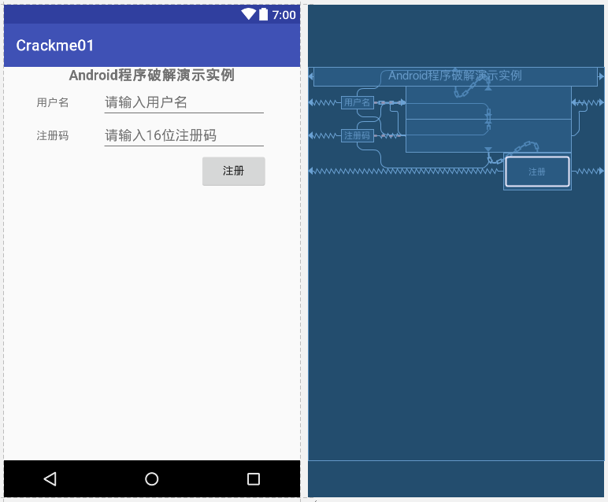
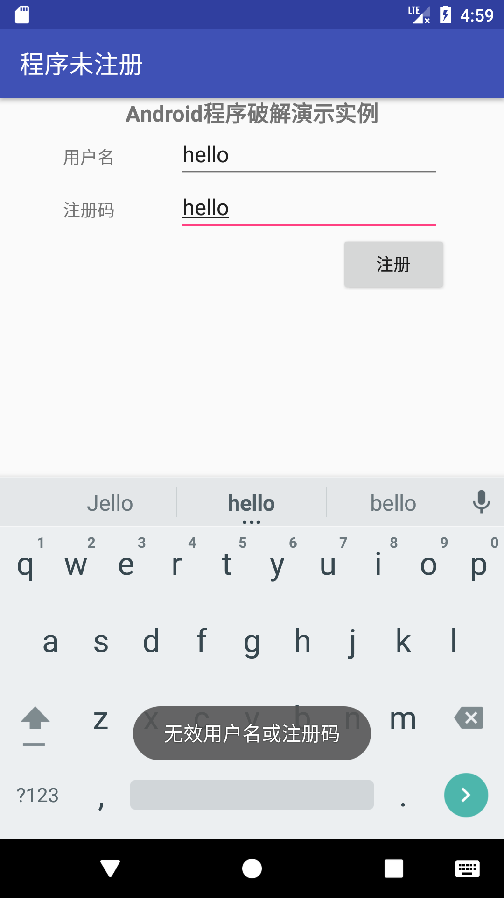
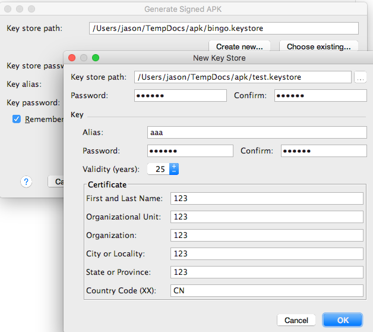
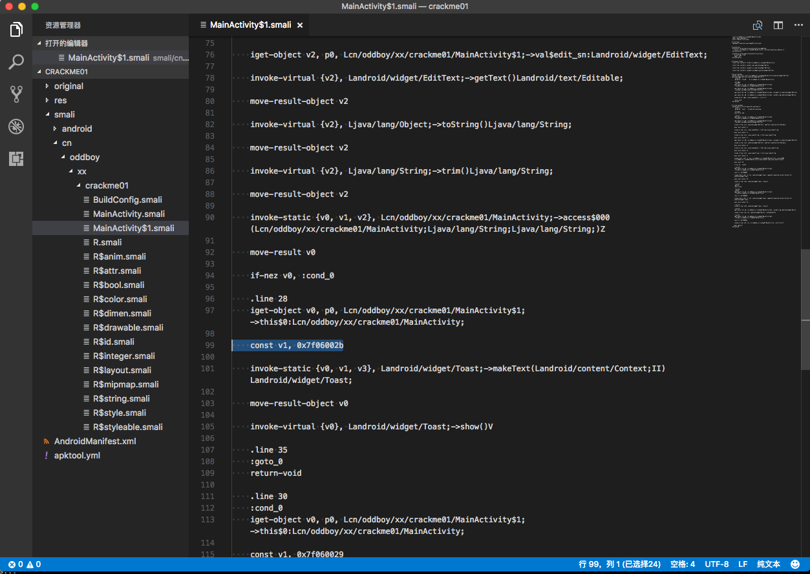
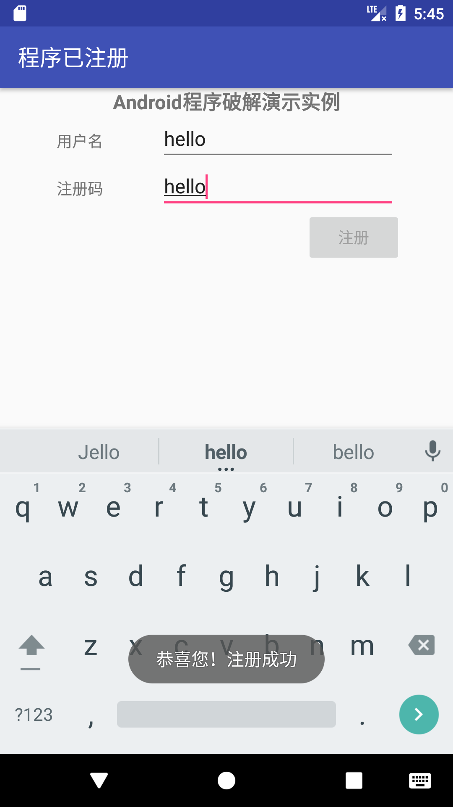

>   原本尝试刷一把某SRC，结果因为其对外服务的基本都是APP，故而尝试逆向其APK。  结果可想而知，一脸懵逼，无从入手。 故而找了个本《Android软件安全与逆向分析》，照着学学。

## 开发环境安装

[Android开发者官网](https://developer.android.com)

[Android Studio下载页面](https://developer.android.com/studio/index.html)

[Android Studio 2.3.3.0 for mac下载直连](https://dl.google.com/dl/android/studio/install/2.3.3.0/android-studio-ide-162.4069837-mac.dmg)

[Android NDK](https://developer.android.com/ndk/downloads/index.html) # 其实这个工具在这里并没有用到，可以等后续再下载安装。

\# Android Studio包含了JDK，故而不需要单独安装JDK。
上述链接应该是都需要翻墙才能访问。

<!--more-->

## 项目编码
打开AS，一路Next，就新建好一个项目。

>   第一次新建项目，可能会卡住，跟一个叫gradle的东西相关，可以选择慢慢等，也可以考虑手动从官方下载（[gradle-3.3](https://services.gradle.org/distributions/gradle-3.3-all.zip
)），然后替换了本地下载尚未下载完成的~/.gradle/wrapper/dists/gradle-3.3-all/55gk2rcmfc6p2dg9u9ohc3hw9/gradle-3.3-all.zip文件。

打开app/res/layout/activity_main.xml,设计layout。

采用Android最新的约束性布局ConstraintLayout。


具体的xml代码如下：
```
<?xml version="1.0" encoding="utf-8"?>
<android.support.constraint.ConstraintLayout
    xmlns:android="http://schemas.android.com/apk/res/android"
    xmlns:tools="http://schemas.android.com/tools"
    xmlns:app="http://schemas.android.com/apk/res-auto"
    android:layout_width="match_parent"
    android:layout_height="match_parent"
    tools:context="cn.oddboy.xx.crackme01.MainActivity"
    tools:layout_editor_absoluteY="81dp"
    tools:layout_editor_absoluteX="0dp">

    <TextView
        android:id="@+id/textView"
        android:layout_width="368dp"
        android:layout_height="25dp"
        android:text="@string/str_androidInstance"
        android:textAlignment="center"
        android:textAllCaps="false"
        android:textSize="18sp"
        android:textStyle="bold"
        app:layout_constraintRight_toRightOf="parent"
        app:layout_constraintLeft_toLeftOf="parent"
        app:layout_constraintBottom_toTopOf="@+id/userName"
        app:layout_constraintTop_toTopOf="parent" />

    <TextView
        android:id="@+id/textView2"
        android:layout_width="wrap_content"
        android:layout_height="17dp"
        android:text="@string/str_serialNo"
        android:textAlignment="center"
        android:textSize="14sp"
        app:layout_constraintBottom_toBottomOf="@+id/sn"
        app:layout_constraintTop_toTopOf="@+id/sn"
        app:layout_constraintLeft_toLeftOf="parent"
        app:layout_constraintRight_toLeftOf="@+id/sn" />

    <TextView
        android:id="@+id/textView3"
        android:layout_width="wrap_content"
        android:layout_height="17dp"
        android:text="@string/str_username"
        android:textAlignment="center"
        android:textSize="14sp"
        app:layout_constraintBottom_toBottomOf="@+id/userName"
        app:layout_constraintTop_toTopOf="@+id/userName"
        app:layout_constraintRight_toLeftOf="@+id/userName"
        app:layout_constraintLeft_toLeftOf="parent" />

    <EditText
        android:id="@+id/sn"
        android:layout_width="215dp"
        android:layout_height="43dp"
        android:ems="10"
        android:hint="@string/str_input16chars"
        android:inputType="textPersonName"
        app:layout_constraintBottom_toTopOf="@+id/button"
        app:layout_constraintLeft_toLeftOf="@+id/userName"
        app:layout_constraintRight_toRightOf="@+id/userName"
        app:layout_constraintTop_toBottomOf="@+id/userName" />

    <EditText
        android:id="@+id/userName"
        android:layout_width="215dp"
        android:layout_height="43dp"
        android:ems="10"
        android:hint="@string/str_pleaseinputusername"
        android:inputType="textPersonName"
        app:layout_constraintBottom_toTopOf="@+id/sn"
        app:layout_constraintLeft_toRightOf="@+id/textView3"
        app:layout_constraintRight_toRightOf="parent"
        app:layout_constraintTop_toBottomOf="@+id/textView" />

    <Button
        android:id="@+id/button"
        android:layout_width="88dp"
        android:layout_height="48dp"
        android:text="@string/str_register"
        app:layout_constraintTop_toBottomOf="@+id/sn"
        app:layout_constraintRight_toRightOf="parent"
        app:layout_constraintLeft_toLeftOf="parent"
        android:layout_marginTop="-13dp"
        app:layout_constraintHorizontal_bias="0.858" />

</android.support.constraint.ConstraintLayout>

```

打开app/java/cn.oddboy.xx.crackme01/MainActivity.java,编写逻辑代码。

```
package cn.oddboy.xx.crackme01;

import android.support.v7.app.AppCompatActivity;
import android.os.Bundle;
import android.view.View;
import android.widget.Button;
import android.widget.EditText;
import android.widget.Toast;

import java.security.MessageDigest;
import java.security.NoSuchAlgorithmException;


public class MainActivity extends AppCompatActivity {

    @Override
    protected void onCreate(Bundle savedInstanceState) {
        super.onCreate(savedInstanceState);
        setContentView(R.layout.activity_main);
        setTitle(R.string.unregister);
        final EditText edit_userName=(EditText)findViewById(R.id.userName);
        final EditText edit_sn=(EditText)findViewById(R.id.sn);
        final Button btn_reg=(Button)findViewById(R.id.button);
        btn_reg.setOnClickListener(new View.OnClickListener() {
            @Override
            public void onClick(View view) {
                if (!checkSN(edit_userName.getText().toString().trim(),edit_sn.getText().toString().trim())) {
                    Toast.makeText(MainActivity.this, R.string.unsucessed, Toast.LENGTH_SHORT).show();
                }else {
                    Toast.makeText(MainActivity.this,
                            R.string.successed,Toast.LENGTH_SHORT).show();
                    btn_reg.setEnabled(false);
                    setTitle(R.string.registered);
                }
            }
        });
    }
    public static String bytesToHex(byte[] in) {
        final StringBuilder builder = new StringBuilder();
        for(byte b : in) {
            builder.append(String.format("%02x", b));
        }
        return builder.toString();
    }
    private boolean checkSN(String userName, String sn){
        try{
            if ((userName==null)||(userName.length()==0))
                return false;
            if ((sn==null)||(sn.length()==0))
                return false;
            MessageDigest digest=MessageDigest.getInstance("MD5");
            digest.reset();
            digest.update(userName.getBytes());
            byte[] bytes=digest.digest();
            String hexstr= bytesToHex(bytes);
            StringBuilder sb = new StringBuilder();
            for (int i=0;i<hexstr.length();i+=2){
                sb.append(hexstr.charAt(i));
            }
            String userSN=sb.toString();
            if (!userSN.equalsIgnoreCase(sn))
                return false;
        } catch (NoSuchAlgorithmException e){
            e.printStackTrace();
            return false;
        }
        return true;
    }
}
```
app/res/values/strings.xml
```
<resources>
    <string name="app_name">Crackme01</string>
    <string name="unregister">程序未注册</string>
    <string name="unsucessed">无效用户名或注册码</string>
    <string name="successed">恭喜您！注册成功</string>
    <string name="registered">程序已注册</string>
    <string name="str_register">注册</string>
    <string name="str_androidInstance">Android程序破解演示实例</string>
    <string name="str_username">用户名</string>
    <string name="str_serialNo">注册码</string>
    <string name="str_pleaseinputusername">请输入用户名</string>
    <string name="str_input16chars">请输入16位注册码</string>
</resources>
```
## 让程序Run起来
在AS中run - Run"app"，如果没有虚拟机，可以新建一个。


## 发布APK

- "Build -> Build APK" 一键生成APK，但这种方式生成APK应该不能安装（因为没有签名）

- "Build -> Generate Signed APK"。选择keystore然后Next就可以了。

    
    此处也可以用keytool工具生成keystore文件。命令如下：
    ```bash
    keytool -genkey -v -keystore bingo.keystore -alias bingo -keyalg RSA -validity 10000
    ```
## APK逆向
>   APK逆向的可用工具太多了，我完全懵逼了。这里只说明我用的工具，到底还有什么好用的工具我是不知道的。

- apktool  用于反编译和重新编译

```
➜  apktool d crackme01.apk
I: Using Apktool 2.2.3 on crackme01.apk
I: Loading resource table...
I: Decoding AndroidManifest.xml with resources...
I: Loading resource table from file: /Users/jason/Library/apktool/framework/1.apk
I: Regular manifest package...
I: Decoding file-resources...
I: Decoding values */* XMLs...
I: Baksmaling classes.dex...
I: Copying assets and libs...
I: Copying unknown files...
I: Copying original files...
```

- 把整个生成的crackme01文件夹拽入visual studio code中。

- 搜索关键字"无效用户名或注册码"，在res/values/strings.xml中找到:
>       <string name="unsucessed">无效用户名或注册码</string>
- 搜索关键字"unsucessed",在res/values/public.xml中找到:
>       <public type="string" name="unsucessed" id="0x7f06002b" />
- 搜索关键字"0x7f06002b",在smali/cn/oddboy/xx/crackme01/MainActivity$1.smali中找到响应的代码。



- 具体代码的分析，我还不太会。按照书上的说法，将94行的if-nez指令改为if-eqz指令即可，保存。

- 重新生成APK
```
➜  apktool b crackme01
I: Using Apktool 2.2.3
I: Checking whether sources has changed...
I: Smaling smali folder into classes.dex...
I: Checking whether resources has changed...
I: Building resources...
I: Building apk file...
I: Copying unknown files/dir...
# 生成的APK在crackme01/dist/crackme01.apk
```

- 重新签名

```
➜ jarsigner -verbose -keystore test.keystore crackme01/dist/crackme01.apk aaa
输入密钥库的密码短语:
   正在添加: META-INF/MANIFEST.MF
   正在添加: META-INF/AAA.SF
   正在添加: META-INF/AAA.RSA
  正在签名: AndroidManifest.xml
  正在签名: classes.dex
  ......
  正在签名: resources.arsc
jar 已签名。
```



## 后记
    路还远着，无FUCK说。 搞这么点东西，也花了一整天时间了。