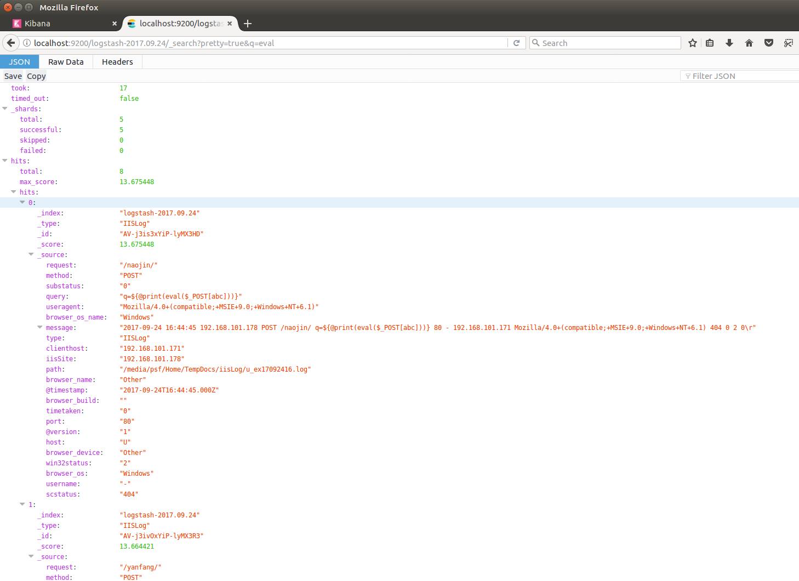
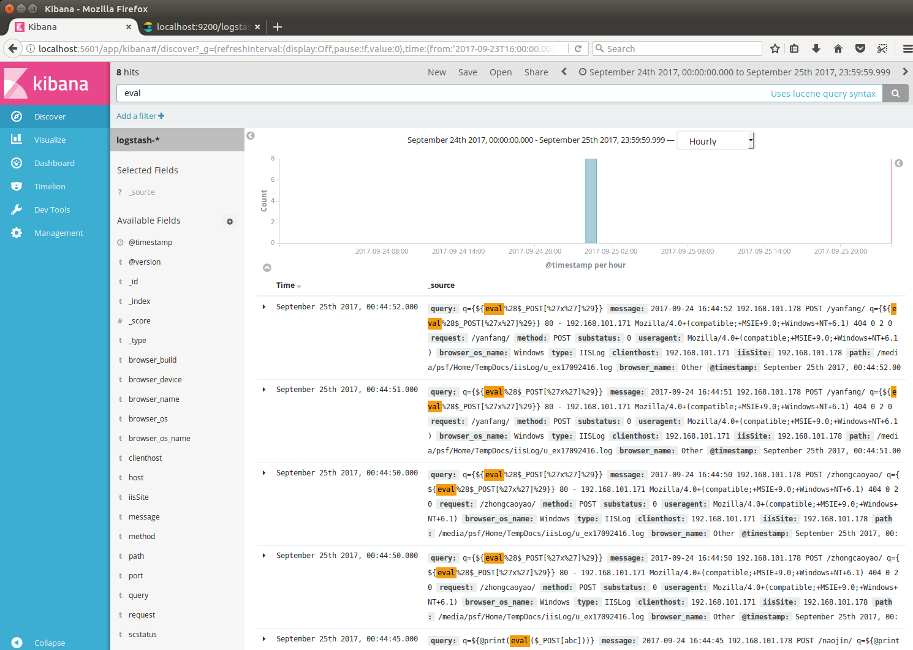

ELK的声名早有耳闻，日志分析领域不可忽视的解决方案，是时候实际搞一搞了。

Elasticsearch：负责日志存储、检索和分析

LogStash：负责日志的收集、处理

Kibana：负责日志的可视化

当前环境：Ubuntu16.04LTS

<!--more-->

## Logstash

#### 1. 安装JDK

虽然JRE也能用，但我偏偏还是喜欢JDK。 主机上以前已经安装过JAVA，检查一下版本。 
```bash
bingo@U:/elk$ java -version
openjdk version "1.8.0_131"
OpenJDK Runtime Environment (build 1.8.0_131-8u131-b11-2ubuntu1.16.04.3-b11)
OpenJDK 64-Bit Server VM (build 25.131-b11, mixed mode)
```

#### 2. 安装logStash
Logstash是一个接收，处理，转发日志的工具，通过在配置文件中添加或者修改**inputs**、**outputs**、**filters**，就可以使随意的格式化日志数据成为可能，从而订制更合理的存储格式为查询提供便利。

从官网下载安装包 [https://www.elastic.co/downloads/logstash](https://www.elastic.co/downloads/logstash)，官方提供了很多种安装方式，yum/apt/rpm/deb/zip等等，当前最新稳定版本为 5.6.4

```bash
bingo@U:/elk$ sudo dpkg -i ./logstash-5.6.4.deb
Selecting previously unselected package logstash.
(Reading database ... 250151 files and directories currently installed.)
Preparing to unpack .../Downloads/logstash-5.6.4.deb ...
Unpacking logstash (1:5.6.4-1) ...
Setting up logstash (1:5.6.4-1) ...
Using provided startup.options file: /etc/logstash/startup.options
Successfully created system startup script for Logstash

# 配置logstash的环境变量
touch /etc/profile.d/logstash.sh
echo "export PATH=\$PATH:/usr/share/logstash/bin" > /etc/profile.d/logstash.sh
. /etc/profile
```
logstash路径：```/usr/share/logstash/```

#### 3. logstash配置

官方文档 : [https://www.elastic.co/guide/en/logstash/current/configuration-file-structure.html](https://www.elastic.co/guide/en/logstash/current/configuration-file-structure.html)

logstash代理是一个具有3个阶段的处理流水线：输入→过滤器→输出。 输入生成事件，过滤器修改它们，输出将其发送到别的地方。

- 配置文件结构：
```python
# 配置文件中可以使用 # 号作为注释符
input {
  ...
}

filter {
  ...
}

output {
  ...
}
```
每个部分都包含一个或多个插件的配置选项。 如果指定了多个过滤器，则会按照他们的配置文件中的显示顺序应用它们。

- 插件配置

插件配置由插件名及其随后的配置块构成：
```bash
input {
    # 第一个插件
    file {    
        path => "/var/log/messages"
        type => "syslog"
    }
    # 第二个插件
    file {
        path => "/var/log/apache/access.log"
        type => "apache"
    }
}
```
如上插件中的配置项为：path和type。 不同的插件所能配置的配置项是有所不同的。


- 配置sample
```bash
# 从控制台输入后不作处理直接输出。
input {stdin{}} output {stdout{}}   

# 从控制台输入后，格式化输出。
input {stdin{}} output{stdout{codec => rubydebug}}

# 根据某客户IIS7.5日志数据定制的，不清楚是否与默认的格式匹配
input {
    file {
        type => "IISLog"
        path => ["/media/psf/Home/TempDocs/iisLog/sample.log"]
        start_position => beginning   #监听文件的起始位置，默认是end
    }
    #stdin{}
}
filter {
    ## Ignore the comments that IIS will add to the start of the W3C logs
    #
    if [message] =~ "^#" {
        drop {}
    }

     # check that fields match your IIS log settings  
    # grok是logstash中把非标准化的日志数据转换成标准化并且可搜索数据最好的方式。
    # [Logstash Grok filter](https://www.elastic.co/guide/en/logstash/current/plugins-filters-grok.html)
    # [grok debuger](http://grokdebug.herokuapp.com)
    grok {
    match => ["message", "%{TIMESTAMP_ISO8601:log_timestamp} %{IPORHOST:iisSite} %{WORD:method} %{URIPATHPARAM:request} %{NOTSPACE:query} %{NUMBER:port} %{NOTSPACE:username} %{IPORHOST:clienthost} %{NOTSPACE:useragent} %{NUMBER:scstatus} %{NUMBER:substatus} %{NUMBER:win32status} %{NUMBER:timetaken}"]

}
    # set the event timestamp from the log 取log中记录的时间作为elasticSearch中的索引时间
    # https://www.elastic.co/guide/en/logstash/current/plugins-filters-date.html
    date {
        match => [ "log_timestamp", "YYYY-MM-dd HH:mm:ss" ]
        timezone => "Etc/UCT"
    }

    # matches the big, long nasty useragent string to the actual browser name, version, etc
    # https://www.elastic.co/guide/en/logstash/current/plugins-filters-useragent.html
    useragent {
        source=> "useragent"
        prefix=> "browser_"
    }

    mutate {
        remove_field => [ "log_timestamp"]
    }

}
# output logs to console and to elasticsearch
output {
    #stdout { codec => rubydebug }
    #elasticsearch插件配置：https://www.elastic.co/guide/en/logstash/current/plugins-outputs-elasticsearch.html#plugins-outputs-elasticsearch-index
    # http://blog.csdn.net/yesicatt/article/details/53393814
    elasticsearch { 
        hosts => ["localhost:9200"]             # 默认值
        index => ["logstash-%{+YYYY.MM.dd}"]    # 默认值
        id => "my_plugin_id"
        }
}

```

#### 4. 通过-e参数启动，适合于快速测试使用。

```bash
root@U:~# logstash -e "input {stdin{}} output {stdout{}}"
WARNING: Could not find logstash.yml which is typically located in $LS_HOME/config or /etc/logstash. You can specify the path using --path.settings. Continuing using the defaults
Could not find log4j2 configuration at path /usr/share/logstash/config/log4j2.properties. Using default config which logs errors to the console
The stdin plugin is now waiting for input:
hello logstash      # stdin
2017-11-09T01:15:25.393Z U hello logstash   # stdout
```
```
root@U:~# logstash -e "input {stdin{}} output{stdout{codec => rubydebug}}"
WARNING: Could not find logstash.yml which is typically located in $LS_HOME/config or /etc/logstash. You can specify the path using --path.settings. Continuing using the defaults
Could not find log4j2 configuration at path /usr/share/logstash/config/log4j2.properties. Using default config which logs errors to the console
The stdin plugin is now waiting for input:
Helloooooooooooo  Bingoooooo
{
      "@version" => "1",
          "host" => "U",
    "@timestamp" => 2017-11-09T01:18:52.487Z,
       "message" => "Helloooooooooooo  Bingoooooo"
}

```

#### 5. 通过-f参数启动，以配置文件方式启动。
```bash
bingo@U:/usr/share/logstash$ sudo ./bin/logstash -f /etc/logstash/test.conf --config.reload.automatic
[sudo] password for bingo: 
WARNING: Could not find logstash.yml which is typically located in $LS_HOME/config or /etc/logstash. You can specify the path using --path.settings. Continuing using the defaults
Could not find log4j2 configuration at path /usr/share/logstash/config/log4j2.properties. Using default config which logs errors to the console
{
            "request" => "/default.aspx",
          "useragent" => "Mozilla/5.0+(Windows+NT+10.0;+WOW64)+AppleWebKit/537.36+(KHTML,+like+Gecko)+Chrome/46.0.2490.86+Safari/537.36",
    "browser_os_name" => "Windows",
               "type" => "IISLog",
         "clienthost" => "192.168.101.171",
               "path" => "/media/psf/Home/TempDocs/iisLog/sample.log",
      "browser_patch" => "2490",
          "timetaken" => "1201",
      "browser_major" => "46",
           "@version" => "1",
               "host" => "U",
        "win32status" => "0",
         "browser_os" => "Windows",
             "method" => "GET",
          "substatus" => "0",
              "query" => "InfoID=74283&SettingModuleID=1147&tabid=0p://www1.customs.gov.cn/Default.aspx?TabID=433",
      "browser_minor" => "0",
            "message" => "2017-09-25 23:35:04 192.168.101.178 GET /default.aspx InfoID=74283&SettingModuleID=1147&tabid=0p://www1.customs.gov.cn/Default.aspx?TabID=433 80 - 192.168.101.171 Mozilla/5.0+(Windows+NT+10.0;+WOW64)+AppleWebKit/537.36+(KHTML,+like+Gecko)+Chrome/46.0.2490.86+Safari/537.36 200 0 0 1201",
            "iisSite" => "192.168.101.178",
       "browser_name" => "Chrome",
         "@timestamp" => 2017-09-25T23:35:04.000Z,
      "browser_build" => "",
               "port" => "80",
     "browser_device" => "Other",
           "username" => "-",
           "scstatus" => "200"
}
```

## Elasticsearch
#### 1. 安装elasticSearch
下载地址：[https://www.elastic.co/downloads/elasticsearch](https://www.elastic.co/downloads/elasticsearch)
```
bingo@U:/usr/share/logstash$ sudo dpkg -i /media/psf/Home/Downloads/elasticsearch-5.6.4.deb

# Elasticsearch路径 : /usr/share/elasticsearch/
```

#### 2. 运行elasticSearch

- 采坑0x01：```OpenJDK 64-Bit Server VM warning: INFO: os::commit_memory(0x000000008a660000, 1973026816, 0) failed; error='Cannot allocate memory' (errno=12)```

    由于elasticsearch默认分配jvm空间大小为2g，修改jvm空间分配
    ```bash
    root@U:/usr/share/elasticsearch# vim /etc/elasticsearch/jvm.options
    # ***************************************************
    # Xms represents the initial size of total heap space
    # Xmx represents the maximum size of total heap space

    -Xms512m        # 默认是Xms2g
    -Xmx512m        # 默认是Xms2g
    ```
- 采坑0x02: 
    ```bash
    root@U:/usr/share/elasticsearch# ./bin/elasticsearch
    Exception in thread "main" org.elasticsearch.bootstrap.BootstrapException: java.nio.file.NoSuchFileException: /usr/share/elasticsearch/config
    Likely root cause: java.nio.file.NoSuchFileException: /usr/share/elasticsearch/config
    ***
    ***
    ```
    在目录下添加config目录
    ```bash
    bingo@U:/usr/share/elasticsearch$ bin/elasticsearch
    2017-11-09 19:07:39,608 main ERROR Could not register mbeans java.security.AccessControlException: access denied ("javax.management.MBeanTrustPermission" "register")
    ***
    ***
    ERROR: no log4j2.properties found; tried [/usr/share/elasticsearch/config] and its subdirectories
    ```


    正解： ```bingo@U:/usr/share/elasticsearch$ sudo service elasticsearch start```
- 运行验证：
    ```bash
    bingo@U:/usr/share/elasticsearch$ curl http://0.0.0.0:9200
    {
    "name" : "y7WTVkf",
    "cluster_name" : "elasticsearch",
    "cluster_uuid" : "AiASw__aRNqyEA2IUJqVOg",
    "version" : {
        "number" : "5.6.4",
        "build_hash" : "8bbedf5",
        "build_date" : "2017-10-31T18:55:38.105Z",
        "build_snapshot" : false,
        "lucene_version" : "6.6.1"
    },
    "tagline" : "You Know, for Search"
    }
    ```

#### 3. 安装使用elasticsearch-head

官方地址： https://github.com/mobz/elasticsearch-head

```bash
bingo@U:/usr/share$ git clone git://github.com/mobz/elasticsearch-head.git
bingo@U:/usr/share/elasticsearch-head$ sudo apt install npm
bingo@U:/usr/share/elasticsearch-head$ npm install
bingo@U:/usr/share/elasticsearch-head$ npm run start
```
访问： http://localhost:9100/

## Kibana
#### 1. 安装Kibana

下载地址： https://www.elastic.co/downloads/kibana
```bash
bingo@U:/usr/share/elasticsearch$ sudo dpkg -i /media/psf/Home/Downloads/kibana-5.6.4-amd64.deb

# 目录 ： /usr/share/kibana
```

#### 2. 运行Kibana

```bash
bingo@U:/usr/share/kibana$ sudo vim /etc/kibana/kibana.yml
*********************
# The URL of the Elasticsearch instance to use for all your queries.
elasticsearch.url: "http://localhost:9200"

*********************
bingo@U:/usr/share/kibana$ sudo bin/kibana
[sudo] password for bingo: 
  log   [11:59:11.223] [info][status][plugin:kibana@5.6.4] Status changed from uninitialized to green - Ready
  log   [11:59:11.339] [info][status][plugin:elasticsearch@5.6.4] Status changed from uninitialized to yellow - Waiting for Elasticsearch
  log   [11:59:11.386] [info][status][plugin:console@5.6.4] Status changed from uninitialized to green - Ready
  log   [11:59:11.437] [info][status][plugin:metrics@5.6.4] Status changed from uninitialized to green - Ready
  log   [11:59:11.807] [info][status][plugin:timelion@5.6.4] Status changed from uninitialized to green - Ready
  log   [11:59:11.842] [info][listening] Server running at http://localhost:5601
  log   [11:59:11.850] [info][status][ui settings] Status changed from uninitialized to yellow - Elasticsearch plugin is yellow
  log   [11:59:16.888] [info][status][plugin:elasticsearch@5.6.4] Status changed from yellow to yellow - No existing Kibana index found
  log   [11:59:18.560] [info][status][plugin:elasticsearch@5.6.4] Status changed from yellow to green - Kibana index ready
  log   [11:59:18.564] [info][status][ui settings] Status changed from yellow to green - Ready

...
...
```
直接访问： http://localhost:5601

#### 3. 使用Kibana

主要使用lucene查询语法：
https://www.elastic.co/guide/en/elasticsearch/reference/5.6/query-dsl-query-string-query.html#query-string-syntax

比如：查询eval关键字

直接在elasticsearch中查询：
http://localhost:9200/logstash-2017.09.24/_search?pretty=true&q=eval



在kibana中查询：




## 结语

如此，ELK算是初步运行起来了。

实用的运用姿势待进一步挖掘。 

比如：
    geoip IP分析插件
    attackfilter 攻击分析插件
    kabana中可视化
    ....