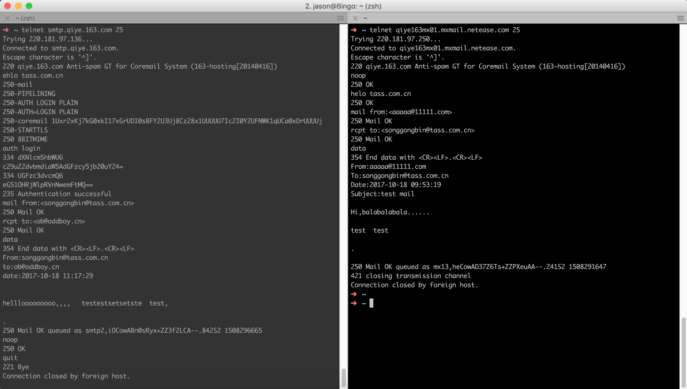
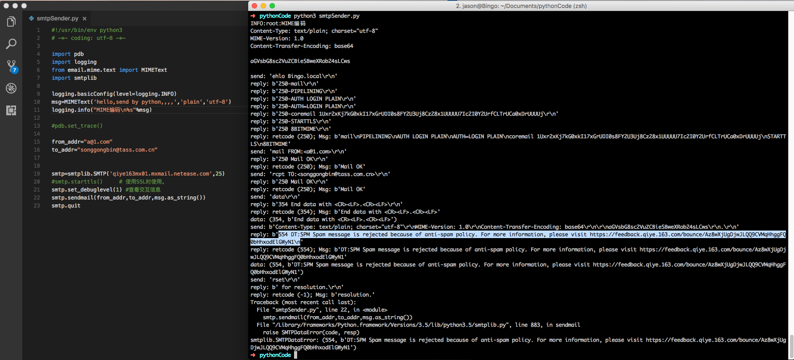

## SMTP发送邮件 - 命令行
**SMTP (Simple Mail Transfer Protocol)** : 电子邮件从客户机传输到服务器或从某一个服务器传输到另一个服务器使用的传输协议。 SMTP 是请求/响应协议，命令和响应都是基于 ASCII 文本，并以 CR 和 LF 符结束。响应包括一个表示返回状态的三位数字代码。SMTP 在 TCP 协议 25 端口监听连接请求。

**ESMTP (Extended SMTP)**，顾名思义，扩展 SMTP 就是对标准 SMTP 协议进行的扩展。它与 SMTP 服务的区别仅仅是，使用 SMTP 发信不需要验证用户帐户，而用 ESMTP 发信时， 服务器会要求用户提供用户名和密码以便验证身份。验证之后的邮件发送过程与 SMTP 方式一致。
<!-- more -->
### SMTP命令
**HELO** 向服务器标识用户身份。(SMTP)

**EHLO** 向服务器标识用户身份。(ESMTP)

**AUTH LOGIN** 用户身份认证，后续陆续发送用户名和密码的base64编码。

**MAIL FROM** 命令中指定的地址是发件人地址

**RCPT TO** 标识单个的邮件接收人；可有多个 RCPT TO；常在 MAIL 命令后面。

**DATA** 在单个或多个 RCPT 命令后，表示所有的邮件接收人已标识，并初始化数据传输，以 CRLF.CRLF 结束 

**VRFY** 用于验证指定的用户/邮箱是否存在；由于安全方面的原因，服务器常禁止此命令

**EXPN** 验证给定的邮箱列表是否存在，扩充邮箱列表，也常被禁用 

**HELP** 查询服务器支持什么命令 

**NOOP** 无操作，服务器应响应 OK 

**RSET** 重置会话，当前传输被取消

**QUIT** 结束会话 

- 正常发信模式（client --> server)

    类似于邮件客户端将邮件发送到自己的邮件服务器。所以需要验证发件人的账号密码。
- 伪造发信模式(fake server --> server)
    
    类似于A.com向B.com发送邮件，直接连接到B.com的服务器然后宣称自己是A.com。这就不需要身份验证了。但如果A.com配置了SPF，那么B.com服务器将校验spf声明的邮件服务器IP与当前发件服务器IP是否一致，如否则拒绝接受！

- 两种模式的命令行试验：
    

## SMTP发送邮件 - Python3

参考资料：[廖雪峰-Python教程-SMTP发送邮件](https://www.liaoxuefeng.com/wiki/0014316089557264a6b348958f449949df42a6d3a2e542c000/001432005226355aadb8d4b2f3f42f6b1d6f2c5bd8d5263000)

简单的代码实现如下：
```python
#!/usr/bin/env python3
# -*- coding: utf-8 -*-

import pdb
import logging
from email.mime.text import MIMEText
import smtplib

logging.basicConfig(level=logging.INFO)
msg=MIMEText('hello,send by python,,,,','plain','utf-8')
logging.info("MIME编码\n%s"%msg)

#pdb.set_trace()

from_addr="a@1.com"
to_addr="songgongbin@tass.com.cn"


smtp=smtplib.SMTP('qiye163mx01.mxmail.netease.com',25)
#smtp.starttls()     # 使用SSL时使用。
smtp.set_debuglevel(1) #查看交互信息
smtp.sendmail(from_addr,to_addr,msg.as_string())
smtp.quit
```

发送肯定是没问题的，但显然命中了网易的反垃圾邮件策略，被拒收了！具体什么是怎样的策略，我不是很清楚了。

## 其它

在线邮件伪造工具：[http://tool.chacuo.net/mailanonymous/](http://tool.chacuo.net/mailanonymous/)

Python官方资料：[https://docs.python.org/3.6/library/smtplib.html#](https://docs.python.org/3.6/library/smtplib.html#)

