>   2017版OWASP top 10 将API安全纳入其中，足以说明API被广泛使用且安全问题严重。自己尝试整理一下，但限于本人搬砖经验还不足、水平有限，本文只能算是抛砖引玉，希望大伙不吝赐教。

# 了解Web Service（API）
    Web Service是一种跨编程语言和跨操作系统平台的远程调用技术。目前被广泛运用于移动端APP、物联网IoT、WEB应用等场景。

<!-- more -->

## 主流Web Service实现方式
### SOAP/XML
    简单对象访问协议(SOAP)接口，通过HTTP进行消息传输。它是基于xml语言开发，使用Web服务描述语言(WSDL)来进行接口描述。是一种很成熟的Web Service实现方式，整体上有被REST取代的趋势。

### REST/JSON
    表现层状态转移(REST),本质上讲的是一种ROA（Resource Oriented Architecture）架构风格。符合这种架构风格的API接口，我们称之为RESTful API。
    PS: REST风格的接口既可以使用JSON，也可以使用XML，但由于JSON更加轻，故而基本不用XML。
XML示例:
```
<?xml version="1.0" encoding="UTF-8" ?>
	<person>
		<name>Jason</name>
		<age>99</age>
		<sex>male</sex>
		<contact>
			<mobile>13888888888</mobile>
			<email>bingo@tass.com.cn</email>
			<wechat>bingo</wechat>
		</contact>
	</person>
```
JSON示例:
```
{
  "person": {
    "name": "Jason",
    "age": "99",
    "sex": "male",
    "contact": {
      "mobile": "13888888888",
      "email": "bingo@tass.com.cn",
      "wechat": "bingo"
    }
  }
}
```

# API安全

## API的安全要素

- 认证和鉴权 - 认证用户身份 & 确定用户权限

    通常情况下，webAPI是基于HTTP协议的，也是无状态传输的。故而认证任务就需要我们自己实现，所以原则上每一次API请求都需要带上身份认证信息，通常使用的是API key。
- 加密和签名 - 保证信息的保密性和完整性

    通常使用SSL/TLS来加密通信消息，由API客户端发送和接收。签名用于确保API请求和响应在传输过程中未被篡改。

- 漏洞 - 注入攻击 & 敏感数据泄露 & 越权访问

## 攻击面检测
- 尽可能多的了解API端点、消息、参数、行为。
- 发现API中可能存在问题的元数据。
- 记录流量进一步学习API
- 爆破 - 暴力破解路径或资源

## 攻击方式
1.模糊测试

    使用自动化工具并行的将大量的随机内容（各种可能的值或可能的攻击向量）作为输入参数进行长时间的尝试，并自动验证响应信息，确认是否获取到意外收获（系统或代码相关的信息）。
2.注入攻击

    使用SQL,XML,Xpath,JSON,JavaScript等的常见攻击向量尝试进行代码注入，并验证意外响应。
3.无效/越界内容

    尝试各种无效或者超范围的内容，并验证响应信息。
4.恶意内容

    在上传功能点尝试上传可执行文件或脚本等，使服务器尝试进行解析。
5.XSS

    上传常见攻击向量进行XSS（反射型，存储型等）测试。
6.CSRF

    测试API是否含有token，token是否能复用，是否可被伪造。
7.不安全的直接对象引用

    尝试对顺序化的id号进行越权访问，尝试访问无权限的方法或操作。
8.其它考虑

    会话认证（token是否正确使用）
    安全配置（前述攻击照成系统/应用等信息泄露）

# 攻击演示
## 1. DVWS | WSDL Enumeration
前端页面
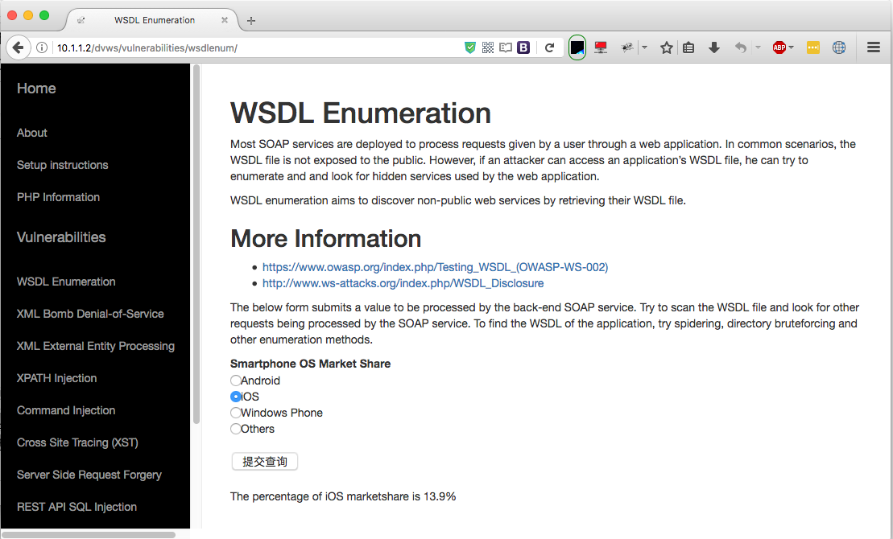

源码中暴露wsdl文件
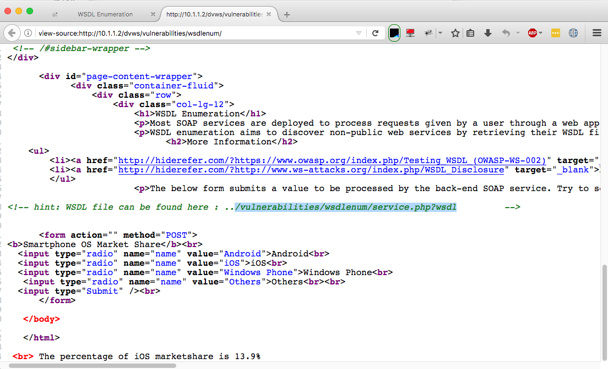

wsdl文件中可以查看到四种方法
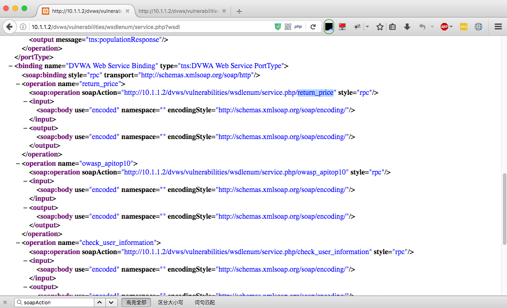

使用READY!API（SOAPUI升级版）可以直观的看到4种方法并进行接口测试

尝试使用check_user_information方法，尝试填入username（实际测试中可能需要结合爆破方式），接口返回了相关数据，从而导致数据泄露。
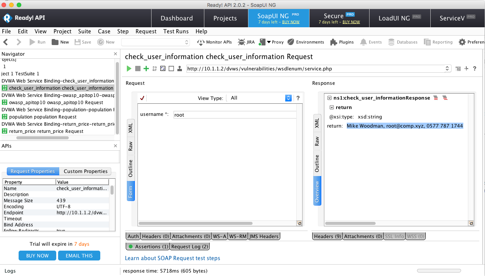

## 2. DVWS | XML External Entity Processing

提交正常请求:
```
<name>Mr.Bingo</name>
```

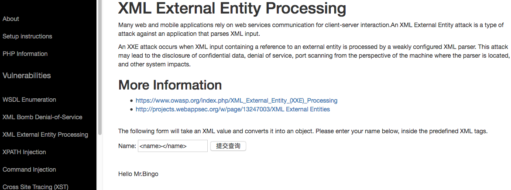
提交payload:
```
<?xml version="1.0"?> <!DOCTYPE bingo [  <!ENTITY xxe SYSTEM "file:///etc/passwd" >]><name>&xxe;</name>
```
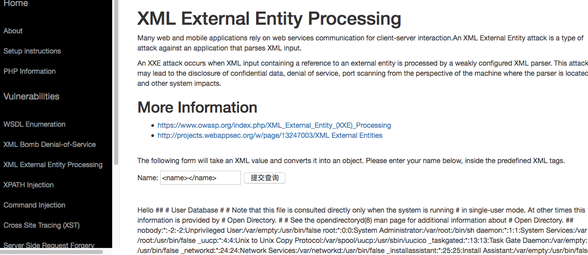

额外测试：

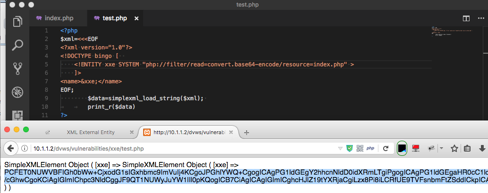
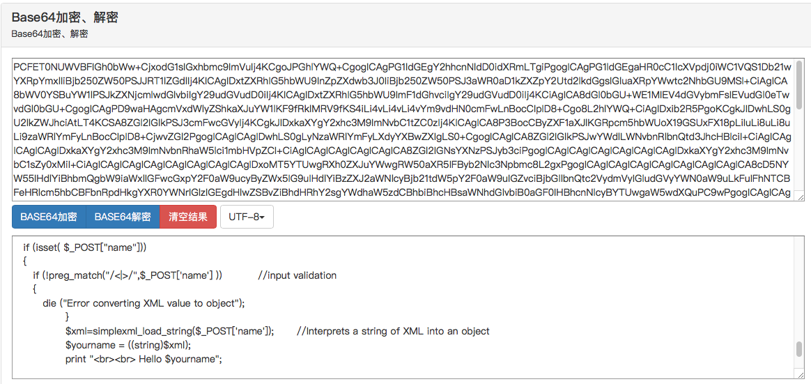

## 3. DVWS | Server Side Request Forgery
正常数据请求

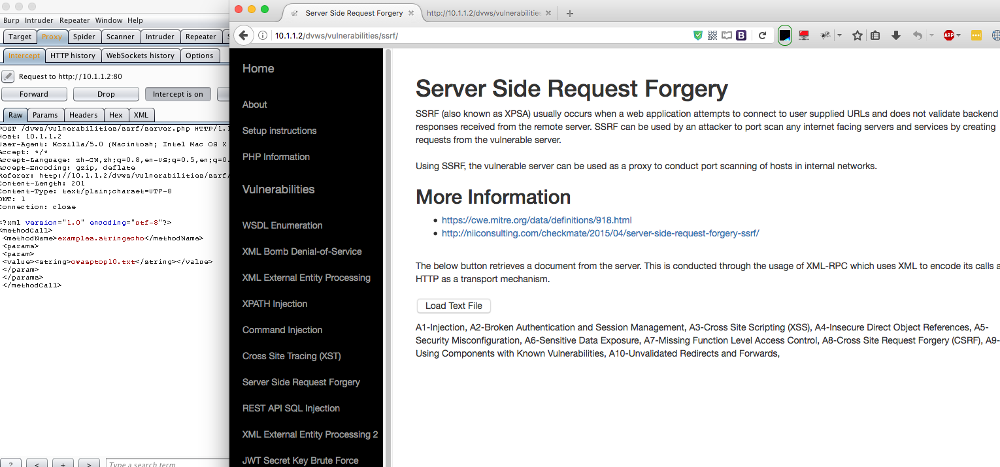
篡改请求URL

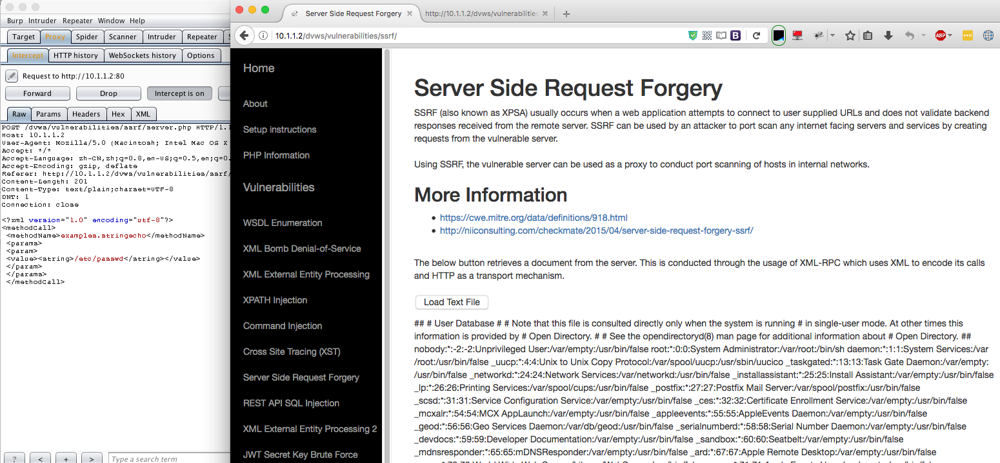

## 4. DVWS | REST API SQL Injection
正常请求资源：

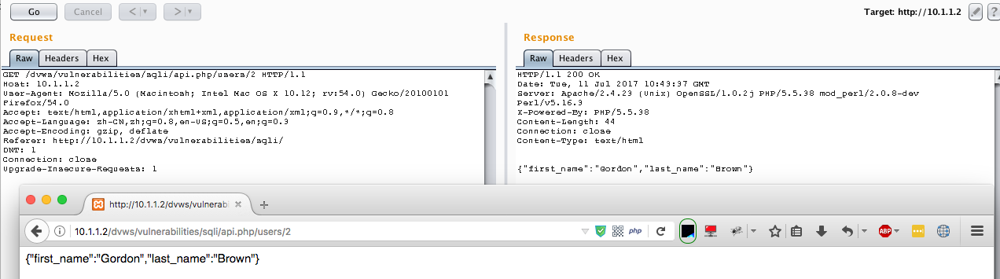

SQL注入：

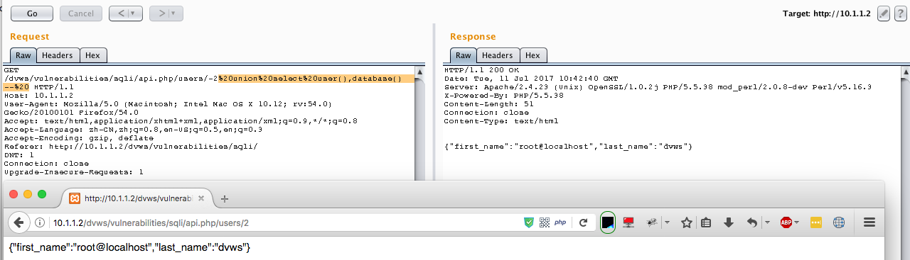

## 5. bWAPP | SQL Injection - Blind (WS/SOAP)
由于在前端屏蔽了后端所采用的API接口功能，故而贴出部分源码以供参考
```
<?php
if(isset($_REQUEST["title"]))
{   
    // Includes the NuSOAP library
    require_once("soap/nusoap.php");

    // Creates an instance of the soap_client class
    $client = new nusoap_client("http://localhost/bWAPP/ws_soap.php");

    // Calls the SOAP function
    $tickets_stock = $client->call("get_tickets_stock", array("title" => sqli($_REQUEST["title"])));

    echo "We have <b>" . $tickets_stock . "</b> movie tickets available in our stock.";
}
?>
```
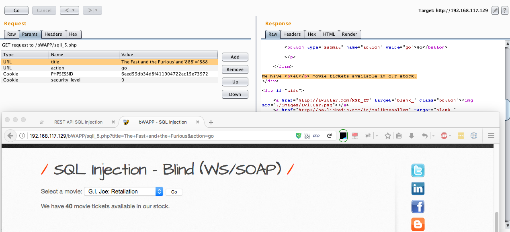

>   当前个人对API接口测试的理解尚比较粗浅。涉及到fuzz、加解密及其他复杂的场景尚且无法拿出好的案例及测试平台。后续有机会再行补充，另外，希望有货的大佬们能多多分享。

# 参考资料
## 测试工具
- Ready!API ( SoapUI )
- Burpsuite
- FuzzAPI
## 测试平台

- DVWS  [https://github.com/snoopythesecuritydog/dvws](https://github.com/snoopythesecuritydog/dvws)

- bWAPP [https://sourceforge.net/projects/bwapp/](https://sourceforge.net/projects/bwapp/)

- Hackazon  [https://github.com/rapid7/hackazon](https://github.com/rapid7/hackazon)

    Web Version [http://hackazon.webscantest.com](http://hackazon.webscantest.com)
- Mutillidae    [https://sourceforge.net/projects/mutillidae/](https://sourceforge.net/projects/mutillidae/)

- Juice-shop    [https://github.com/bkimminich/juice-shop](https://github.com/bkimminich/juice-shop)


## 参考资料
- OWASP Top 10 - 2017 RC1

- REST API 安全设计指南 [http://www.freebuf.com/articles/web/82108.html](http://www.freebuf.com/articles/web/82108.html)

- REST Security Cheat Sheet [https://www.owasp.org/index.php/REST_Security_Cheat_Sheet](https://www.owasp.org/index.php/REST_Security_Cheat_Sheet)