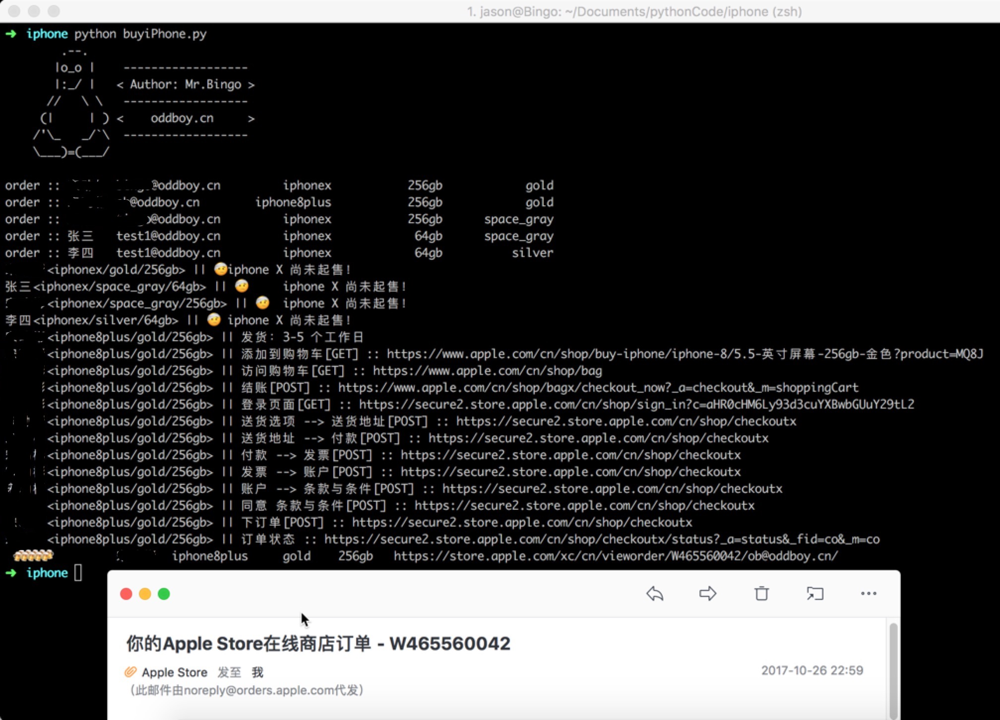
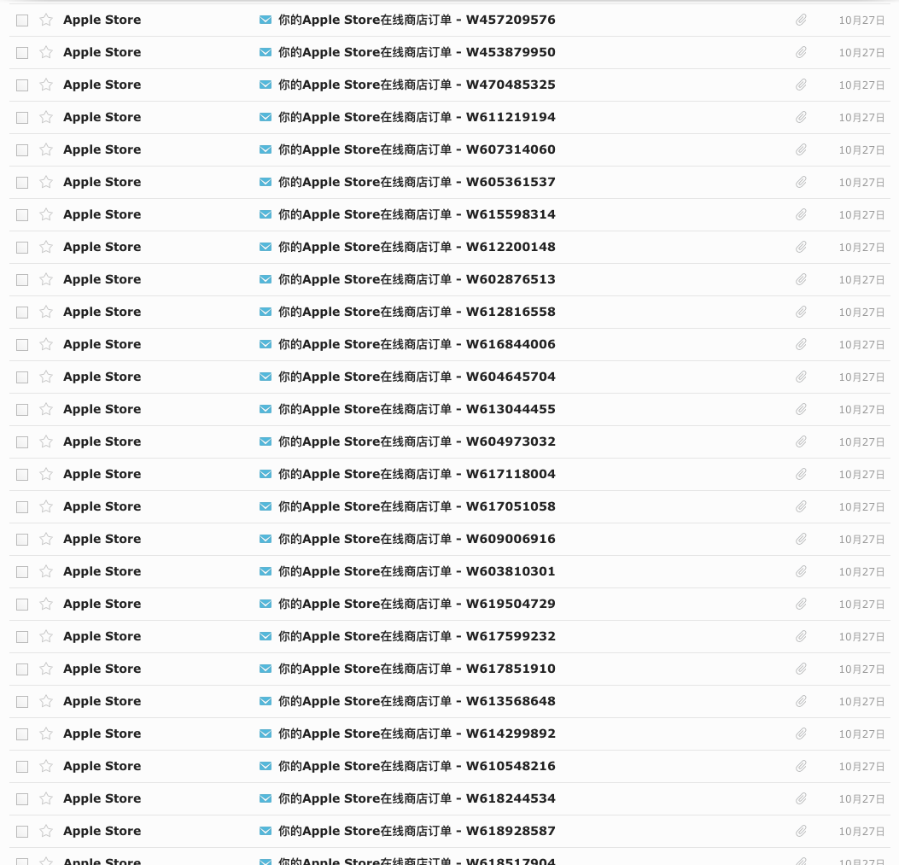
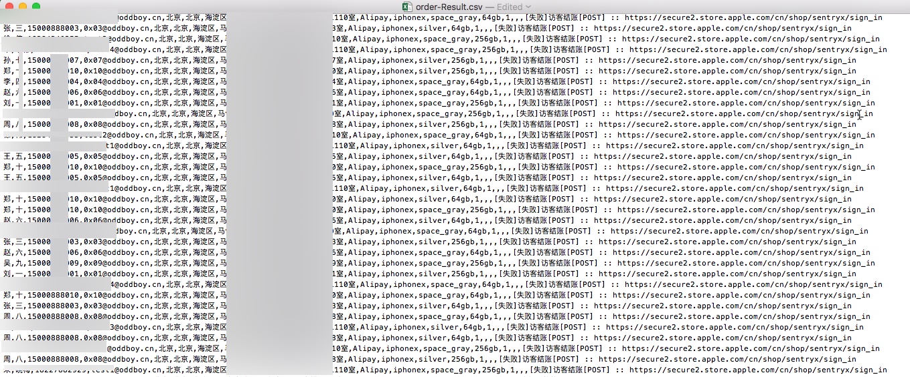

## 叨逼叨
原本以为iPhone X会被疯抢，所谓八仙过海各显神通，我就想着用自己的野路子看看凑效不？

经过几天的流程梳理，代码编写及优化，在27号前夕以iPhone 8作为测试，效果是灰常的好！
<!--more-->


批量下单(iphone8/8p),跑了40个订单,每个订单一条线程，20秒左右全部订单成功，邮箱也瞬间收到几十封邮件：



## 失落的转折
27日早上开始，苹果官网下单功能维护，直到下午三点功能才正常。 不过，在购物车跳转到支付页面的相关参数被改动了。所以，gg了！



## 记录总结一下 | 付出总会有收获

几天过去了，今天回过头来稍微整理下，记录下来，好歹也付出过不是？

今天再次查看苹果网站，之前修改的参数点现在又修改回去了。不过在最后的下订单环节应该有增加了一些防护，所以我的脚本还是不能用。

-----
- python可以直接读取json文件转换为dict.非常好用！
- 用datetime库来判断时间点：
    ```python
    tmp= datetime.datetime(2017,10,27,6,58).timestamp()-time.timezone - datetime.datetime.now().timestamp()
    if tmp>0:  # UTC时间！   
        print(orderIdentify+"🤕\tiphone X 尚未起售！ == %d minutes =="%(tmp/60))
        return```
- 使用requests.session类来处理多步骤的请求，可以自动处理cookie问题，自动重试功能也非常赞！
    ```python
    session=requests.session()      # session会话可以自动保存和处理cookie
    session.proxies=proxies
    session.verify=False
    session.timeout=30          # 此处设置timeout无用
    session.headers={'User-Agent':userAgent}
    # https://stackoverflow.com/questions/15431044/can-i-set-max-retries-for-requests-request/
    session.mount('https://', requests.adapters.HTTPAdapter(max_retries=retryTime-1))     # 实际会重试 max_retries +1 次   所以将retry次数先减1
    session.mount('http://', requests.adapters.HTTPAdapter(max_retries=retryTime-1))
    ```
- 也许直接使用浏览器模拟器是更好的选择（如mechanize selenium），虽然“重”了些，但简单易处理。

## 上代码 | 感兴趣的拿走不谢
```python
#!/usr/bin/env python3
# -*- coding: utf-8 -*-
# Author : Mr.Bingo
# Version : 2.0
# Description : 

import pdb
import requests
import logging
import json
import sys
import os
import re
import threading
import datetime,time
from requests.packages.urllib3.exceptions import InsecureRequestWarning

requests.packages.urllib3.disable_warnings(InsecureRequestWarning)

logging.basicConfig(level=logging.INFO)


#orderPath= os.path.join(os.path.split(os.path.abspath(__file__))[0],u'order')     # json文件格式订单
orderFile= os.path.join(os.path.split(os.path.abspath(__file__))[0],'order.txt')    # txt订单格式
#   lastName | firstName | phone | email | state | city | district | street | payment | product | color | capacity | quantity
#   邓 | 六 | 15000555000 | test3@oddboy.cn | 北京 | 北京 | 海淀区 | XXX路17号 | Alipay | iphone8 | glod | 256gb | 2
orderResult = os.path.join(os.path.split(os.path.abspath(__file__))[0],'order-Result.csv')  # 成功订单

# orderSuccess = os.path.join(os.path.split(os.path.abspath(__file__))[0],'order-Success.txt')  # 成功订单
# orderFail = os.path.join(os.path.split(os.path.abspath(__file__))[0],'order-Fail.txt')  # 失败订单

class iPhoneBuyer(object):
    # 初始化
    def __init__(self):
        self.dispData=[]    # list
        self.threadLock = threading.Lock()  # 进程锁，主要用于写文件！
        pass

    # 多线程情况下美化，格式化输出消息。
    def display(self):
        pass

    # 开启多线程 一个订单一个线程
    def run_Threads(self):
        thread_arr=[]       # 线程列表
        threading.Thread(target=self.display)     

        # json文件格式订单读取
        # logging.info("\r[info] Order Path : %s "%orderPath[:80])
        # for dirpath,dirname,files in os.walk(orderPath):
        #     print(files)
        #     for f in files:
        #         if re.match(r'^order.*\.json$',f):
        #             f=os.path.join(orderPath,f)
        #             logging.info(f)
        #             with open(f,encoding='utf-8') as fp:
        #                 order=json.load(fp)
        #                 order['fileFullName']= f
        #                 logging.debug(order)
        #                 print("\n> order's phone :: "+order['phone'])
        #                 #pdb.set_trace()
        #                 t=threading.Thread(target=self.buy,args=(order,))
        #                 thread_arr.append(t)

        if not os.path.exists(orderFile):
            print("没有订单文件！！！")
            sys.exit(0)
        
        with open(orderFile,encoding='utf-8') as fp:
            raw_orders = fp.readlines()
            tmp = False
            for raw_order in raw_orders:
                if not tmp:
                    tmp =True
                    continue    # 跳过order.txt文件的第一行
              
                raw_order = str(raw_order).replace(' ','')  # 删除所有空格
                logging.debug(raw_order)
                if not re.match(r'^((.*?\|){13})',raw_order):      # 简单检查订单格式
                    continue
                l = raw_order.split("|")
                order={}
                order['lastName'] = l[0]
                order['firstName'] = l[1]
                order['phone'] = l[2]
                order['email'] = l[3]
                order['state'] = l[4]
                order['city'] = l[5]
                order['district'] = l[6]
                order['street'] = l[7]
                order['payment'] = l[8]
                order['product'] = l[9]
                order['color'] = l[10]
                order['capacity'] = l[11]
                order['quantity'] = l[12]
                logging.debug(order)
                t=threading.Thread(target=self.buy,args=(order,))
                thread_arr.append(t)

        for t in range(len(thread_arr)):
            thread_arr[t].start()       # 启动线程。         
        
        for t in range(len(thread_arr)):
            thread_arr[t].join()        # 收拢
        pass

    # 处理购买
    def buy(self,order):
        retryTime = 5       # 请求失败后重试次数
        retryTimeout = 30     # 全局超时时间
        orderIdentify = order['lastName']+order['firstName']+"<"+order['product']+"/"+ order['color']+"/"+order['capacity']+"> || "
        # n = 0         # 测试代码
        # while n < 5:
        #     print(threading.current_thread().name)
        #     n = n + 1
        #     time.sleep(1)
        # return 
        userAgent="Mozilla/5.0 (Windows; U; Windows NT 6.1; zh-CN) AppleWebKit/533+ (KHTML, like Gecko)"   # aywysya可能需要与此值匹配。
        cookies={}
        proxies={
            "http": "http://127.0.0.1:8080",     # 本地监听
            "https": "https://127.0.0.1:8080"
        }
        print('order :: '+order['lastName']+order['firstName']+"\t"+order['email']+"\t%15s\t%15s\t%15s"%(order['product'],order['capacity'],order['color']) )
        time.sleep(0.5)
        if order['product']=="iphone8" or order['product']=='iphone8plus':
            url="https://www.apple.com/cn/shop/buy-iphone/iphone-8"
        elif order['product']=='iphonex':
            #if datetime.datetime.now().timestamp() < datetime.datetime(2017,10,27,15,0).timestamp():    #从时间判断是否起售
            tmp= datetime.datetime(2017,10,27,6,58).timestamp()-time.timezone - datetime.datetime.now().timestamp()
            if tmp>0:  # UTC时间！   
                print(orderIdentify+"🤕\tiphone X 尚未起售！ == %d minutes =="%(tmp/60))
                return
            else:
                url="https://www.apple.com/cn/shop/buy-iphone/iphone-x"

        session=requests.session()      # session会话可以自动保存和处理cookie
        session.proxies=proxies
        session.verify=False
        session.timeout=30          # 此处设置timeout无用
        session.headers={'User-Agent':userAgent}
        # https://stackoverflow.com/questions/15431044/can-i-set-max-retries-for-requests-request/
        session.mount('https://', requests.adapters.HTTPAdapter(max_retries=retryTime-1))     # 实际会重试 max_retries +1 次   所以将retry次数先减1
        session.mount('http://', requests.adapters.HTTPAdapter(max_retries=retryTime-1))


        # logging.debug("GET请求 :: %s"%url)
        #r = session.get(url,timeout=reqTimeout)
        # logging.info("获得cookie :: %s"%print(r.cookies)[:80])

        # 在products.json中遍历对应产品,PS:从网页获取比较麻烦。
        if not os.path.exists(os.path.join(os.path.split(os.path.abspath(__file__))[0],"products.json")):
            print("\n\t\tproducts.json文件不存在！\n")
            sys.exit(0)
        currentProduct={}
        with open(os.path.join(os.path.split(os.path.abspath(__file__))[0],"products.json"),encoding='utf-8') as productFileHandle:    
            products = json.load(productFileHandle)
            for p in products:
                #pdb.set_trace()
                if p['productLocatorFamily']==order['product'] and p['dimensionCapacity']==order['capacity'] and p['dimensionColor']==order['color']:
                    logging.debug("产品型号 : %s\t%s"%(p['partNumber'],p['seoUrlToken'])[:80])
                    currentProduct=p
                    break   # 找到相应产品，退出for循环
            if len(currentProduct) == 0:
                print("未找到相应产品\t%s\t%s\t%s"%(order['product'],order['capacity'],order['color']) )
                return
            # close products.json
        try:
        #if True:
            # 验证是否启售
            while True:

                # 重试方式，但太复杂，且用修饰器也并不好实现。
                # n = 0
                # while n<retryTime:
                #     try:
                #         r=session.get("https://www.apple.com/cn/shop/delivery-message?parts.0="+currentProduct['partNumber'],timeout=reqTimeout)
                #         n = n + 10000       # 请求成功，跳出循环
                #     except Exception as e:
                #         n = n + 1
                #         if n>=retryTime:
                #         print("重试次数过多！！！ <退出>")
                #         return
                # end while
                order['remark']='出师未捷 :: '+"https://www.apple.com/cn/shop/delivery-message?parts.0="+currentProduct['partNumber']
                logging.debug("\n%s\n"%currentProduct)
                r=session.get("https://www.apple.com/cn/shop/delivery-message?parts.0="+currentProduct['partNumber'],timeout=retryTimeout)
                logging.debug(r.text)
                deliveryMsg = json.loads(r.text,encoding='utf-8')
                #print(orderIdentify+"%s  %s"%(deliveryMsg['body']['content']['deliveryMessage'][currentProduct['partNumber']]['orderByDeliveryBy'],deliveryMsg['body']['content']['deliveryMessage'][currentProduct['partNumber']]['deliveryOptionMessages']))

                if '未发售' in deliveryMsg['body']['content']['deliveryMessage'][currentProduct['partNumber']]['deliveryOptionMessages'][0] :
                    print(orderIdentify+currentProduct['seoUrlToken']+" || 暂未发售")
                    time.sleep(3)   # 隔三秒钟
                else:
                    print(orderIdentify+deliveryMsg['body']['content']['deliveryMessage'][currentProduct['partNumber']]['orderByDeliveryBy']+deliveryMsg['body']['content']['deliveryMessage'][currentProduct['partNumber']]['deliveryOptionMessages'][0])
                    break       # 起售！！！   跳出while死循环

            # 添加购物车
            addCartUrl=url+"/"+currentProduct['seoUrlToken']+"?product="+currentProduct['partNumber']    \
                        +"&purchaseOption=fullPrice"                                    \
                        +"&step=select"                                                 \
                        +"&dimensionCapacity="+currentProduct['dimensionCapacity']      \
                        +"&dimensionColor="+currentProduct['dimensionColor']            \
                        +"&part="+currentProduct['part']                                \
                        +"&complete=true"                                               \
                        +"&dimensionScreensize="+currentProduct['dimensionScreensize']  \
                        +"&add-to-cart=add-to-cart"
            print(orderIdentify+"添加到购物车[GET] :: %s"%addCartUrl[:80])
            r = session.get(addCartUrl,timeout=retryTimeout)
            
            #pdb.set_trace()
            # 访问购物车
            shopBagUrl="https://www.apple.com/cn/shop/bag"
            print(orderIdentify+"访问购物车[GET] :: %s"%shopBagUrl[:80])
            order['remark']="[失败]访问购物车 :: %s"%shopBagUrl
            r = session.get(shopBagUrl,timeout=retryTimeout)
            
            token=re.search(r'\"x-aos-stk\":\"(.*?)\"',r.text).group(1)
            # requests.utils.add_dict_to_cookiejar(session.cookies,{"x-aos-stk":token})   # 此语句是将token添加到cookie.

            # 修改数量  可修改为2      此处cookie中需要携带x-aos-stk，应该类似于token的作用。    # 应该可以省略！！！！！ 在结账步骤可一同实现。
            # tmp=re.search(r'"updateQuantity":{"url":"(/cn/shop/bagx\?_a=updateQuantity&_m=(shoppingCart.items.item-.*?))"',r.text)
            # updateQuantityUrl="https://www.apple.com"+tmp.group(1)
            # if order['quantity']=='2':
            #     r= session.post(updateQuantityUrl,data={tmp.group(2)+".quantity":"2"},headers={"x-aos-stk":token},timeout=reqTimeout)
                
            #     #pdb.set_trace()
            #     print()
            
            # 结账
            tmp=re.search(r'\"updateQuantity\":{\"url\":\"(/cn/shop/bagx\?_a=updateQuantity&_m=(shoppingCart.items.item-.*?))\"',r.text)
            checkoutUrl="https://www.apple.com/cn/shop/bagx/checkout_now?_a=checkout&_m=shoppingCart"
            print(orderIdentify+"结账[POST] :: %s"%checkoutUrl[:80])
            order['remark']="[失败]结账[POST] :: %s"%checkoutUrl
            r= session.post(checkoutUrl,data={tmp.group(2)+".quantity":order['quantity'],'shoppingCart.actions.fcscounter':'NaN','shoppingCart.actions.fcsdata':''},headers={"x-aos-stk":token},timeout=retryTimeout)
            
            #pdb.set_trace()
            signinUrl=json.loads(r.text,encoding='utf-8')['head']['data']['url']
            print(orderIdentify+"登录页面[GET] :: %s"%signinUrl[:80])

            order['remark']="[失败]登录页面[GET] :: %s"%signinUrl
            r=session.get(signinUrl,timeout=retryTimeout)
            
            guestBuyData=re.search(r'\"signInGuest\":\{\"form\":\"login\._forms\.guestCheckoutForm\",\"url\":\"/cn/shop/sentryx/sign_in\?(_a=login\.guestSign.*?)\"',r.text).group(1)
            
            tmp = re.findall(r'(.*?=.*?)&',guestBuyData+"&")
            data={}
            for i in tmp:
                data[i.split("=",maxsplit=1)[0]]=i.split("=",maxsplit=1)[1]
            
            # 两个复杂参数，硬编码！  
            data['aywysya']='78a44j1d7lY5BNvcKyAdMUDFBpBeA0fUm7qKFz0XnjYrJFW73AuyPBB2SCVMvsD7z5meTuCUMz_WgpMVQdgGgeVjrkRGjftckcKyAd65hz74WySXvO3wa3wL6tqAhbrmQkLNbfyz.sU7zl998tp7ppeZLz77qZoOSix5ezdstlYrMxy0kyMpwoNLTK9Ly9nOVlQtb_GGEOpBSKxUC56MnGWpwoNSUC53ZXnN87gq1aWuxXVvHe9FjpidPNs0ojpVMZ90L5H6fqUdHz15tTma1eWNieLqDxpHrk0ugN.xL438IXkb9CxN4t1VKWZWudUd.z9euVrAqJkJgghmeugN.VHBQLz4mvmfTT9oaSumKkpjlRiwerbXh8bUudQUhkY5BSmmY5BNkOdhs7GY6Mk.BY8'
            data['fdcBrowserData']='%257B%2522U%2522%253A%2522Mozilla%252F5.0%2520(Windows%253B%2520U%253B%2520Windows%2520NT%25206.1%253B%2520zh-CN)%2520AppleWebKit%252F533%252B%2520(KHTML%252C%2520like%2520Gecko)%2522%252C%2522L%2522%253A%2522zh-CN%2522%252C%2522Z%2522%253A%2522GMT%252B08%253A00%2522%252C%2522V%2522%253A%25221.0%2522%257D'
            tmpUrl = re.search(r'(https:\/\/secure.?\.store\.apple\.com)\/cn\/shop\/',r.text).group(1)+'/cn/shop/sentryx/sign_in'
            logging.debug("访客结账[POST] :: %s"%tmpUrl)
            order['remark']="[失败]访客结账[POST] :: %s"%tmpUrl
            r = session.post(tmpUrl,data=data,timeout=retryTimeout)
            
            pltn = json.loads(r.text,encoding='utf-8')['head']['data']['args']['pltn']
            checkoutStartUrl = json.loads(r.text,encoding='utf-8')['head']['data']['url']

            logging.debug("结账跳转-1 [POST] :: %s"%checkoutStartUrl)
            order['remark']="[失败]结账跳转-1 [POST] :: %s"%checkoutStartUrl
            r = session.post(checkoutStartUrl,data={'pltn':pltn},timeout=retryTimeout)
            
            data={}
            checkoutUrl = re.search(r'<form method=\"POST\" name=\"redirector\" action=\"(https://.*?)\"',r.text).group(1)
            data['pltn'] = re.search(r'<input name="pltn" type="\w*?" value="(.*?)"',r.text).group(1)
            data['v'] = re.search(r'<input name="v" type="\w*?" value="(.*?)"',r.text).group(1)
            data['sessionID'] = re.search(r'<input name="sessionID" type="\w*?" value="(.*?)"',r.text).group(1)
            logging.debug("结账跳转-2 [POST] :: %s"%checkoutUrl)
            order['remark']="[失败]结账跳转-2 [POST] :: %s"%checkoutUrl
            r = session.post(checkoutUrl,data=data,timeout=retryTimeout)
            
            # 送货选项 --> 送货地址
            data={}
            data['sessionID']=re.search(r'\{\"name\":\"sessionID\",\"value\":\"(.*?)\"\}',r.text).group(1)
            # data['A8']=re.search(r',"deliveryLocationType":"(.*?)","_forms":{"main":{"fields":\[{"id":"(cart-item-.*?deliveryLocationType)",',r.text).group(1)
            # data['cartItem']=re.search(r',"deliveryLocationType":"(.*?)","_forms":{"main":{"fields":\[{"id":"(cart-item-.*?deliveryLocationType)",',r.text).group(2)
            #data[re.search(r'\"id\":\"(cart-item-.*?deliveryLocationType)\",',r.text).group(1)]='A8'   # 2017-10-26发现该正则表达式存在匹配问题,匹配了超长的字符串
            data[re.search(r'(cart-item-([0-9A-z]+-){5}delivery-deliveryLocationType)',r.text).group(1)]='A8'
            
            data['_a']='cart.cont'
            data['_fid']='co'
            data['_m']='cart'
            # 有多台secure主机，需要从页面取值。
            checkoutxUrl = re.search(r'(https:\/\/secure.?\.store\.apple\.com)\/cn\/shop\/',r.text).group(1)+'/cn/shop/checkoutx'
            print(orderIdentify+"送货选项 --> 送货地址[POST] :: %s"%checkoutxUrl[:80])
            order['remark']="[失败]送货选项 --> 送货地址[POST] :: %s"%checkoutxUrl
            r = session.post(checkoutxUrl,data=data,timeout=retryTimeout)
            
            # 送货地址 --> 付款
            data={}
            data['sessionID'] = re.search(r'\{\"name\":\"sessionID\",\"value\":\"(.*?)\"\}',r.text).group(1)
            data['shipping-user-lastName'] = order['lastName']
            data['shipping-user-firstName'] = order['firstName']
            data['shipping-user-daytimePhoneAreaCode'] = '0'
            data['shipping-user-daytimePhone'] = order['phone']
            data['shipping-user-state'] = order['state']
            data['shipping-user-city'] = order['city']
            data['shipping-user-district'] = order['district']
            data['shipping-user-street'] = order['street']
            data['shipping-user-street2'] = ''
            data['shipping-user-postalCode'] = ''
            data['shipping-user-emailAddress'] = order['email']
            data['shipping-user-mobilePhone'] = order['phone']
            data['state'] = order['state']
            data['keyPath'] = 'shipping.address'
            data['city'] = order['city']
            data['_a'] = 'ship.cont'
            data['_fid'] = 'co'

            print(orderIdentify+"送货地址 --> 付款[POST] :: %s"%checkoutxUrl[:80])
            order['remark']="[失败]送货地址 --> 付款[POST] :: %s"%checkoutxUrl
            r = session.post(checkoutxUrl,data=data,timeout=retryTimeout)
            
            # 付款 --> 发票
            data={}
            data['sessionID'] = re.search(r'\{\"name\":\"sessionID\",\"value\":\"(.*?)\"\}',r.text).group(1)
            data['undefined'] = ''
            data['bankOption'] = 'Alipay'
            data['_a'] = 'bill.cont'
            data['_fid'] = 'co'

            print(orderIdentify+"付款 --> 发票[POST] :: %s"%checkoutxUrl[:80])
            order['remark']="[失败]付款 --> 发票[POST] :: %s"%checkoutxUrl
            r = session.post(checkoutxUrl,data=data,timeout=retryTimeout)
            
            # 发票 --> 账户
            data={}
            data['invoice-user-invoiceEmailAddress-emailAddress'] = order['email']
            data['invoice-fapiao-invoiceHeader'] = order['lastName']+order['firstName']
            data['invoice-fapiao-taxPayerId'] = ''
            data['invoice-form-options-selection'] = 'personal'
            data['sessionID'] = re.search(r'\{\"name\":\"sessionID\",\"value\":\"(.*?)\"\}',r.text).group(1)
            data['invoice-user-invoiceDeliveryAddress-lastName'] = order['lastName']
            data['invoice-user-invoiceDeliveryAddress-firstName'] = order['firstName']
            data['invoice-user-invoiceDeliveryAddress-daytimePhoneAreaCode'] = '0'
            data['invoice-user-invoiceDeliveryAddress-daytimePhone'] = order['phone']
            data['invoice-user-invoiceDeliveryAddress-companyName'] = ''
            data['invoice-user-invoiceDeliveryAddress-state'] = order['state']
            data['invoice-user-invoiceDeliveryAddress-city'] = order['city']
            data['invoice-user-invoiceDeliveryAddress-district'] = order['district']
            data['invoice-user-invoiceDeliveryAddress-street'] = order['street']
            data['invoice-user-invoiceDeliveryAddress-street2'] = ''
            data['invoice-user-invoiceDeliveryAddress-postalCode'] = ''
            data['state'] = order['state']
            data['keyPath'] = 'invoice.invoiceDeliveryAddress'
            data['city'] = order['city']
            data['_a'] = 'invoice.cont'
            data['_fid'] = 'co'

            print(orderIdentify+"发票 --> 账户[POST] :: %s"%checkoutxUrl[:80])
            order['remark']="[失败]发票 --> 账户[POST] :: %s"%checkoutxUrl
            r = session.post(checkoutxUrl,data=data,timeout=retryTimeout)
            
            # 账户 --> 条款与条件
            data = {}
            data['account-appleId'] = ''
            data['account-password'] = ''
            data['account-passwordAgain'] = ''
            data['account-commsPref'] = 'false'
            data['_a'] = 'acct.cont'
            data['_fid'] = 'co'

            print(orderIdentify+"账户 --> 条款与条件[POST] :: %s"%checkoutxUrl[:80])
            order['remark']="[失败]账户 --> 条款与条件[POST] :: %s"%checkoutxUrl
            r = session.post(checkoutxUrl,data=data,timeout=retryTimeout)
            # 同意 条款与条件
            data = {}
            data['sessionID'] = re.search(r'\{\"name\":\"sessionID\",\"value\":\"(.*?)\"\}',r.text).group(1)
            data['accept'] = 'true'
            data['acceptAppleTnc'] = 'false'
            data['_a'] = 'terms.cont'
            data['_fid'] = 'co'

            print(orderIdentify+"同意 条款与条件[POST] :: %s"%checkoutxUrl[:80])
            order['remark']="[失败]同意 条款与条件[POST] :: %s"%checkoutxUrl
            r = session.post(checkoutxUrl,data=data,timeout=retryTimeout)
            
            # 下订单
            data={}
            data['aywysya'] = 'F8a44j1d7lY5BNvcKyAdMUDFBpBeA0fUm7qKFz0XnjYrJFW73AuyPBB2SCVMvsD7z5meTuCUMz_WgpMVQdgGgeVjrkRGjftckcKyAd65hz74WySXvO3wa3wL6tqAhbrmQkLNbfyz.sU7zl998tp7ppeZLz77qZoOSix5ezdstlYrMxy0kyMpwoNLTK9Ly8nOVlQtb_GGEOpBSKxUC56MnGWpwoNSUC53ZXnN87gq1aWux_5ukV_AAUfSHolk2dUf.j7J1gBZEMgzH_y3Cmx_B4K1lSJhgSv_KU.6elV2pNJF_DA1RcrpVMZ90L5H6e0z1_yc4p0iMgdVdOOQ_KpNk0.ZNqhyA_r_LwwKdBvpZfWfUXtStKjE4PIDzpHqzQW5BNv__5BNlVnIQkFY5DjV.4v2'
            data['sessionID'] = re.search(r'\{\"name\":\"sessionID\",\"value\":\"(.*?)\"\}',r.text).group(1)
            data['promo-code'] = ''
            data['_a'] = 'po'
            data['_fid'] = 'co'


            print(orderIdentify+"下订单[POST] :: %s"%checkoutxUrl[:80])
            order['remark']="[存疑]下订单[POST] :: %s"%checkoutxUrl
            r = session.post(checkoutxUrl,data=data,timeout=retryTimeout*2)       # 此处timeout时间加倍
            
            # 订单状态
            
            #checkoutStatusUrl = re.search(r'(https:\/\/.*?\.apple\.com)',checkoutxUrl).group(1)+json.loads(r.text,encoding='utf-8')['head']['data']['url']  
            checkoutStatusUrl = re.search(r'(https:\/\/.*?\.apple\.com)',r.url).group(1)+re.search(r'\"url\":\"(.*?)\"',r.text).group(1)
            order['remark']="[存疑]订单状态-0 :: %s"%tmpUrl
            r = session.get(checkoutStatusUrl,timeout=retryTimeout)

            data={}
            data['_a']='status'
            data['_fid']='co'
            data['_m']='commo'
            tmpUrl = re.search(r'(https:\/\/secure.?\.store\.apple\.com)\/cn\/shop\/',r.text).group(1)+'/cn/shop/checkoutx/status'

            order['remark']="[存疑]订单状态-1 :: %s"%tmpUrl
        
            r = session.post(tmpUrl,data=data,timeout=retryTimeout)

            #tmpUrl = json.loads(r.text,encoding='utf-8')['head']['data']['url']   # 错误
            tmpUrl = re.search(r'(https:\/\/.*?\.apple\.com)',r.url).group(1)+re.search(r'\"url\":\"(.*?)\"',r.text).group(1)
            print(orderIdentify+"订单状态 :: %s"%tmpUrl[:80])
            order['remark']="[存疑]订单状态-2 :: %s"%tmpUrl
            r = session.get(tmpUrl,timeout=retryTimeout)

            # tmpUrl=json.loads(r.text,encoding='utf-8')['head']['data']['url'] #报错
            tmpUrl = re.search(r'(https:\/\/.*?\.apple\.com)',r.url).group(1)+re.search(r'\"url\":\"(.*?)\"',r.text).group(1)

            order['remark']="[存疑]谢谢 :: %s"%tmpUrl
            r = session.get(tmpUrl,timeout=retryTimeout)
            
            orderID = re.search(r',\"orderNumber\":\"(.*?)\",',r.text).group(1)
            order['orderID'] = orderID
            order['orderUrl']="https://store.apple.com/xc/cn/vieworder/"+orderID+"/"+order['email']+"/"
            order['remark']='成功'
            
            msg=order['lastName']+		\
            order['firstName']+"\t"+		\
            order['product']+"\t"+		\
            order['color']+"\t"+		    \
            order['capacity']+"\t"+		\
            order['orderUrl']
            print(" 🍻🍻🍻🍻🍻 \t\t%s"%msg)
            self.orderResult(order,True)

        except Exception as e:
            order['orderID'] = ''
            order['orderUrl'] = ''
            self.orderResult(order,False)  # 购买失败！
        # json订单格式使用！
        # tmp = order['fileFullName']
        # filePath,fileName = os.path.split(tmp)
        # newFileName= "done_"+order['lastName']+order['firstName']+"_"+orderID+"_"+order['email']+fileName
        # logging.info("修改订单文件 :: %s --> %s"%(fileName,newFileName)[:80])
        # os.rename(tmp,os.path.join(filePath,newFileName))

    def orderResult(self,order,success):
        msg=order['lastName']+","+		\
            order['firstName']+","+		\
            order['phone']+","+		    \
            order['email']+","+		    \
            order['state']+","+		    \
            order['city']+","+		    \
            order['district']+","+		\
            order['street']+","+		\
            order['payment']+","+		\
            order['product']+","+		\
            order['color']+","+		    \
            order['capacity']+","+		\
            order['quantity']+","+		\
            order['orderID']+","+		\
            order['orderUrl']+","+      \
            order['remark']+"\n"
        self.threadLock.acquire()
        with open(orderResult,'a+',encoding='utf-8') as fp:
            fp.writelines(msg)
        self.threadLock.release()
# 参数处理
def main():
    headCharPic="\r        .--.\n       |o_o |    ------------------ \n       |:_/ |   < Author: Mr.Bingo >\n      //   \ \   ------------------ \n     (|     | ) <    oddboy.cn     >\n    /'\_   _/`\  ------------------\n    \___)=(___/\n"
    print(headCharPic)
    # Creating a parser
    buyer=iPhoneBuyer()
    buyer.run_Threads()

if __name__ == '__main__':
    main()

```