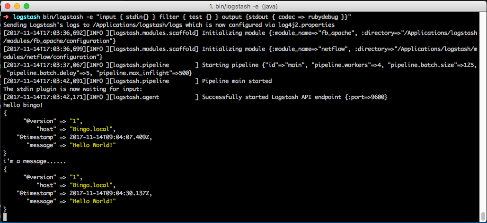
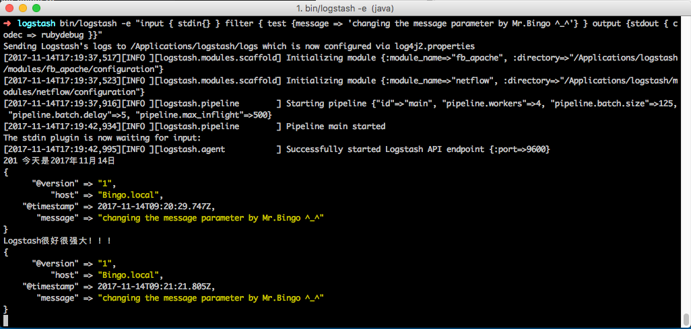

本文主要参考官方文档([How to write a Logstash filter plugin](https://www.elastic.co/guide/en/logstash/current/_how_to_write_a_logstash_filter_plugin.html))进行实践。

## 前面
因为Logstash是用ruby开发的，所以插件也需要用ruby语言进行开发。
相关入门 https://www.ruby-lang.org/en/documentation/quickstart/
<!--more-->
- Ruby
- RVM       Ruby Version Manager 版本管理
- Rails     开发框架，应该类似于Django之类
- RubyGems  Ruby程序包管理器(package manager),类似RedHat的RPM,将一个Ruby应用程序打包到一个gem里。
- Gem       Gem是封装起来的Ruby应用程序或代码库。 注：在终端使用的gem命令，是指通过RubyGems管理Gem包。
- Gemfile   定义应用所依赖的第三方包，bundle根据该配置去寻找这些包。
- Rake      Rake是一门构建语言，和make类似。Rake是用Ruby写的，它支持自己的DSL用来处理和维护Ruby程序。
- Rakefile  Rakefile是由Ruby编写，Rake命令执行的就是由Rakefile文件定义的。
- Bundle    相当于多个RubyGems批处理运行。在配置文件gemfilel里说明你的应用依赖哪些第三方包，他自动帮你下载安装多个包，并且会下载这些包依赖的包。感觉类似于pip
- JRuby     一个采用纯Java实现的Ruby解释器

如有必要，参考官方的filter是一个很好的选择。  https://www.elastic.co/guide/en/logstash/current/filter-plugins.html
```bash
# 使用命令行查看当前已安装的插件
bingo@U:/usr/share/logstash$ logstash-plugin list

# 查找插件插件文件路径
bingo@U:/usr/share/logstash$ find ./ | egrep "logstash-filter.*\.gemspec"
```

PS：之前将logstash部署在Ubuntu虚拟机上的，为了便于开发，在MAC本机也安装一个(下载ZIP包)

## Step by step 入门

#### 1. 为插件创建新的GitHub库( logstash-filter-test )

#### 2. 使用插件生成工具
logstash-plugin命令的generate子命令可以为新插件生成基础文件。它创建目录结构、gemspec文件及依赖关系，只需要添加好自定义代码就可以了。
更多的信息可查阅官方文档：https://www.elastic.co/guide/en/logstash/current/plugin-generator.html

#### 3. 拷贝示例代码
除了上述生成代码外，还可以直接拷贝示例代码，以开始编码。
- 将第1步创建的库克隆到本地
- 克隆广泛example库到本地
- 清除example库中的git信息后将文件拷贝到个人库目录
- 重命名插件名
```bash
git clone https://github.com/odboy/logstash-filter-test.git

git clone https://github.com/logstash-plugins/logstash-filter-example.git

cd logstash-filter-example

rm -rf .git     # 移除git信息

cp -R * ../logstash-filter-test

cd ../logstash-filter-test
# 修改插件名 # 代码和配置文件中的名称也需要一并修改，此处不一一列出
mv logstash-filter-example.gemspec logstash-filter-test.gemspec
mv lib/logstash/filters/example.rb lib/logstash/filters/test.rb
mv spec/filters/example_spec.rb spec/filters/test_spec.rb
# 显示树结构
➜  logstash-filter-test git:(master) ✗ tree ./
./
├── CHANGELOG.md
├── CONTRIBUTORS
├── DEVELOPER.md
├── Gemfile
├── LICENSE
├── NOTICE.TXT
├── README.md
├── Rakefile
├── ci
│   ├── build.sh
│   └── setup.sh
├── lib
│   └── logstash
│       └── filters
│           └── test.rb
├── logstash-filter-test.gemspec
└── spec
    ├── filters
    │   └── test_spec.rb
    └── spec_helper.rb

6 directories, 14 files
```

#### 4. 代码解读
>   ./lib/logstash/filters/test.rb
```ruby
# encoding: utf-8       # 声明编码
require "logstash/filters/base"     
require "logstash/namespace"        

# This example filter will replace the contents of the default
# message field with whatever you specify in the configuration.
#
# It is only intended to be used as an example.
class LogStash::Filters::Test < LogStash::Filters::Base    # 类声明

  # Setting the config_name here is required. This is how you
  # configure this filter from your Logstash config.
  #
  # filter {
  #   test {
  #     message => "My message..."
  #   }
  # }
  #
  config_name "test"    # 插件名

  # Replace the message with this value.
  config :message, :validate => :string, :default => "Hello World!"
  # 参数配置
  # config :variable_name, :validate => :variable_type, :default => "Default value", :required => boolean, :deprecated => boolean, :obsolete => string
  # variable_name就是参数的名称了。
  # validate 定义是否进行校验，如果不是指定的类型，在logstash -f xxx --configtest的时候就会报错。它支持多种数据类型，比如:string, :password, :boolean, :number, :array, :hash, :path (a file-system path), :codec (since 1.2.0), :bytes.
  # default 定义参数的默认值
  # required 定义参数是否是必须值
  # deprecated 定义参数的额外信息，比如一个参数不再推荐使用了，就可以通过它给出提示！典型的就是es-output里面的Index_type，当使用这个参数时，就会给出提示：
  # config :index_type, :validate => :string, :deprecated => "Please use the 'document_type' setting instead. It has the same effect, but is more appropriately named."


  # 过滤器必须实现register和filter方法

  # Logstash中的register方法类似于initialize方法。
  public      # ruby中需要显示声明public
  def register
    # Add instance variables
  end # def register

  # 该filter方法为实际过滤工作发生的地方。在该方法内，可以使用Event对象引用event(事件)数据。
  # Event是在Logstash内部封装数据流的主要对象，并为插件开发人员提供了一个与事件内容交互的API。
  # filter方法还应该通过显示调用Event类中的可用sprintf方法来处理任何“事件相关配置”。

  public
  def filter(event)

    if @message
      # Replace the event message with our message as configured in the
      # config file.

      # using the event.set API
      event.set("message", @message)
      # correct debugging log statement for reference
      # using the event.get API
      @logger.debug? && @logger.debug("Message is now: #{event.get("message")}")
    end

    # filter_matched should go in the last line of our successful code
    # 在成功执行插件时调用filter_matched方法将确保通过Logstash配置为此过滤器添加的任何字段或标记都将被正确处理。 例如，此时将执行任何add_field，remove_field，add_tag和/或remove_tag操作。
    filter_matched(event)   # 该方法会把事件传入下一个过滤器

    # Event方法（如event.cancel）现在可用于控制正在处理的事件的工作流程。
  end # def filter
end # class LogStash::Filters::Test
```

#### 5. 建立插件

在此，我们已经编写好了插件的代码，并准备从中构建一个Ruby Gem。

- 外部依赖
    
    Ruby文件头部的require声明用于包含必要的代码。在某些情况下，我们的插件可能需要额外的文件。 例如，`logstash-codec-collectd`插件使用“collectd”提供的`types.db`文件。位于插件主目录中的`vendor.json`文件描述了这些文件的位置。

    vendor.json文件包含一个JSON对象数组，每个JSON对象描述一个文件依赖关系。这个例子来自[collectd](https://github.com/logstash-plugins/logstash-codec-collectd/blob/master/vendor.json)编解码器插件：

    ```json
    [{
        "sha1": "a90fe6cc53b76b7bdd56dc57950d90787cb9c96e",     # 验证URL引用文件的完整性
        "url": "http://collectd.org/files/collectd-5.4.0.tar.gz",   # Logstash下载该文件的地址
        "files": [ "/src/types.db" ]            # 可选项！ 指定从URL对应文件中提取指定文件，如果不指定，所有文件都会被提取出来。
    }]
    ```
    除了collectd插件外，[geoip插件](https://github.com/logstash-plugins/logstash-filter-geoip/blob/master/vendor.json)也有`vendor.json`文件

    用于下载这些依赖项的过程是`rake vendor`，测试部分进一步说明。

    另外一种外部依赖是在jar文件上，这将在“添加gemspec文件”一节中介绍。

- 添加Gemfile文件

    Gemfile允许Ruby的[Bundler](http://bundler.io/gemfile.html)维护插件的依赖关系。 目前，我们只需要用于测试的Logstash gem，如需要其他gem，则需要添加到这里。

    从example中拷贝过来的Gemfile文件内容如下：
    ```ruby
    source 'https://rubygems.org'

    gemspec

    logstash_path = ENV["LOGSTASH_PATH"] || "../../logstash"
    use_logstash_source = ENV["LOGSTASH_SOURCE"] && ENV["LOGSTASH_SOURCE"].to_s == "1"

    if Dir.exist?(logstash_path) && use_logstash_source
    gem 'logstash-core', :path => "#{logstash_path}/logstash-core"
    gem 'logstash-core-plugin-api', :path => "#{logstash_path}/logstash-core-plugin-api"
    end

    gem "logstash", :github => "elastic/logstash", :branch => "5.6" 
    # 按照教程额外添加的配置项，否则bundle install时会报错：Could not find gem 'logstash-devutils' in any of the gem sources listed in your Gemfile.    
    # 添加该行配置，出现[坑0x02]报错。
    # 经查资料，需要jruby.
    ```

- 添加gemspec文件

    gemspec定义了将被构建并包含插件的Ruby gem。 http://guides.rubygems.org/specification-reference/

    ```ruby
    Gem::Specification.new do |s|
    s.name = 'logstash-filter-test'
    s.version         = '3.0.1'
    s.licenses = ['Apache License (2.0)']   # 如果需要公开插件，则需要添加该license
    s.summary = "This example filter replaces the contents of the message field with the specified value."
    s.description     = "This gem is a Logstash plugin required to be installed on top of the Logstash core pipeline using $LS_HOME/bin/logstash-plugin install gemname. This gem is not a stand-alone program"
    s.authors = ["Mr.Bingo"]
    s.email = 'bingo@oddboy.cn'
    s.homepage = "http://oddboy.cn"
    s.require_paths = ["lib"]

    # Files
    s.files = Dir['lib/**/*','spec/**/*','vendor/**/*','*.gemspec','*.md','CONTRIBUTORS','Gemfile','LICENSE','NOTICE.TXT']
    # Tests
    s.test_files = s.files.grep(%r{^(test|spec|features)/})

    # Special flag to let us know this is actually a logstash plugin
    s.metadata = { "logstash_plugin" => "true", "logstash_group" => "filter" }

    # Gem dependencies
    s.add_runtime_dependency "logstash-core-plugin-api", "~> 2.0"
    s.add_development_dependency 'logstash-devutils'
    end
    ```

- 运行及开发依赖

    在gemspec文件的底部是一个带有注释的部分：Gem依赖关系。所有需要依赖的gem都需要在此声明。 插件需要使用的gem添加到运行时依赖项。 如果只是用于测试，则需要添加到开发依赖项。

    **PS：所有插件对logstash-core-plugin-api gem都有运行时依赖，并且对logstash-devutils有开发依赖。**

- Jar依赖

    在某些情况，例如ElasticSearch的output插件，代码可能会依赖jar文件。在这种情况下，以如下方式在gemspec文件中添加依赖关系。
    ```ruby
    # Jar dependencies
    s.requirements << "jar 'org.elasticsearch:elasticsearch', '5.0.0'"
    s.add_runtime_dependency 'jar-dependencies'
    ```
    不过在filter插件中一般应该不会用到···

#### 6. 调试/测试
既然按照教程添加了GitHub库，最好还是先push一下。
```
git add .
git commit -m "从logstash-filter-example拷 贝"
git push
```
- 使用bundler安装依赖
```bash
# 将Gemfile中的#source 'https://rubygems.org'  修改为 source 'https://gems.ruby-china.org/'

sudo gem install bundle     # 安装bundle
bundle -v                   # Bundler version 1.16.0
#rake vendor                # 如果有vendor.json文件需要使用该命令下载依赖文件
bundle install              # 安装依赖
```
坑0x01:
```bash
➜  logstash-filter-test git:(master) ✗ bundle install
Fetching gem metadata from https://gems.ruby-china.org/..........
Could not find gem 'logstash-devutils' in any of the gem sources listed in your Gemfile.
```
坑0x02:
```bash
➜  logstash-filter-test git:(master) ✗ bundle install
The git source `git://github.com/elastic/logstash.git` uses the `git` protocol, which transmits data without encryption. Disable this warning with `bundle config git.allow_insecure true`, or switch to the `https` protocol to keep your data secure.
Fetching git://github.com/elastic/logstash.git

[!] There was an error while loading `logstash-core-plugin-api.gemspec`: The logstash-core-api need to be build on jruby. Bundler cannot continue.

 #  from /Users/jason/.bundle/ruby/2.0.0/logstash-01a419793a67/logstash-core-plugin-api/logstash-core-plugin-api.gemspec:27
 #  -------------------------------------------
 #    else
 >      raise "The logstash-core-api need to be build on jruby"
 #    end
 #  -------------------------------------------
```
尝试解决：(通过RVM安装Jruby)
```bash
>  vim ~/.zshrc # 添加JAVA相关环境变量。
******************************
export JAVA_HOME=/Library/Java/JavaVirtualMachines/jdk1.8.0_112.jdk/Contents/Home
export CLASSPATH=.:$JAVA_HOME/lib/dt.jar:$JAVA_HOME/lib/tools.jar
export PATH=$JAVA_HOME/bin:$PATH
******************************

# https://ruby-china.org/wiki/rvm-guide
> rvm install jruby     # 安装jruby
>>>>>>>>>>>>>>>>>>>>>>>>>>>>>>
    Searching for binary rubies, this might take some time.
    Found remote file https://s3.amazonaws.com/jruby.org/downloads/9.1.13.0/jruby-bin-9.1.13.0.tar.gz
    Checking requirements for osx.
    Requirements installation successful.
    jruby-9.1.13.0 - #configure
    jruby-9.1.13.0 - #download
    ** Resuming transfer from byte position 397312
    % Total    % Received % Xferd  Average Speed   Time    Time     Time  Current
                                    Dload  Upload   Total   Spent    Left  Speed
    100 19.6M  100 19.6M    0     0  1695k      0  0:00:11  0:00:11 --:--:-- 2474k
    jruby-9.1.13.0 - #validate archive
    jruby-9.1.13.0 - #extract
    jruby-9.1.13.0 - #validate binary
    jruby-9.1.13.0 - #setup
    jruby-9.1.13.0 - #gemset created /Users/jason/.rvm/gems/jruby-9.1.13.0@global
    jruby-9.1.13.0 - #importing gemset /Users/jason/.rvm/gemsets/jruby/global.gems..
    jruby-9.1.13.0 - #generating global wrappers........
    jruby-9.1.13.0 - #gemset created /Users/jason/.rvm/gems/jruby-9.1.13.0
    jruby-9.1.13.0 - #importing gemsetfile /Users/jason/.rvm/gemsets/default.gems evaluated to empty gem list
    jruby-9.1.13.0 - #generating default wrappers........
<<<<<<<<<<<<<<<<<<<<<<<<<<<<<< # done [rvm install jruby]

> rvm gemset create test            # gemset是一个独立的虚拟gem环境，此处创建一个名为test的gemset.

> jruby -version                    # 查看jruby版本 （jruby list known) jruby[-9.1.13.0]

> rvm use jruby-9.1.13.0@test       # 为test gemset配置ruby版本

> gem install bundler               # 安装bundler，否则bundle install会报错：“in `to_specs': Could not find 'bundler' (>= 0) among 16 total gem(s) (Gem::LoadError)”

> bundle install                    # 安装依赖
>>>>>>>>>>>>>>>>>>>>>>>>>>>>>>
    Fetching gem metadata from https://gems.ruby-china.org/..........
    Resolving dependencies..................
    Using rake 12.2.1
    Using bundler 1.16.0
    Fetching numerizer 0.1.1
    Installing numerizer 0.1.1
    #······若干Fetching Installing
    Fetching logstash-core 5.5.1.snapshot1 (java)
    Installing logstash-core 5.5.1.snapshot1 (java)
    jar dependencies for logstash-core-5.5.1.snapshot1-java.gemspec . . .
        org.apache.logging.log4j:log4j-api:2.6.2:compile
        org.apache.logging.log4j:log4j-core:2.6.2:compile
        com.fasterxml.jackson.core:jackson-core:2.7.4:compile
        com.fasterxml.jackson.core:jackson-databind:2.7.4:compile
        com.fasterxml.jackson.module:jackson-module-afterburner:2.7.4:compile
        com.fasterxml.jackson.dataformat:jackson-dataformat-cbor:2.7.4:compile
    Fetching logstash-core-plugin-api 2.1.27 (java)
    Installing logstash-core-plugin-api 2.1.27 (java)
    #······若干Fetching Installing
    Fetching logstash-devutils 1.3.6 (java)
    Installing logstash-devutils 1.3.6 (java)
    Using logstash-filter-test 3.0.1 from source at `.`
    Bundle complete! 2 Gemfile dependencies, 53 gems now installed.
    Use `bundle info [gemname]` to see where a bundled gem is installed.
    Post-install message from jar-dependencies:

    if you want to use the executable lock_jars then install ruby-maven gem before using lock_jars

    $ gem install ruby-maven -v '~> 3.3.11'

    or add it as a development dependency to your Gemfile

    gem 'ruby-maven', '~> 3.3.11'
<<<<<<<<<<<<<<<<<<<<<<<<<<<<<<   # done [bundle install]
```
- 运行tests:
```
> bundle exec rspec

    --- jar coordinate com.fasterxml.jackson.core:jackson-databind already loaded with version 2.7.4 - omit version 2.9.1
    --- jar coordinate com.fasterxml.jackson.core:jackson-annotations already loaded with version 2.7.0 - omit version 2.9.1
    --- jar coordinate com.fasterxml.jackson.module:jackson-module-afterburner already loaded with version 2.7.4 - omit version 2.9.1
    --- jar coordinate com.fasterxml.jackson.core:jackson-core already loaded with version 2.7.4 - omit version 2.9.1
    ERROR StatusLogger No log4j2 configuration file found. Using default configuration: logging only errors to the console.
    Sending Logstash's logs to  which is now configured via log4j2.properties
    Run options: exclude {:redis=>true, :socket=>true, :performance=>true, :couchdb=>true, :elasticsearch=>true, :elasticsearch_secure=>true, :export_cypher=>true, :integration=>true, :windows=>true}

    Randomized with seed 42629
    .

    Finished in 0.25881 seconds (files took 19.52 seconds to load)
    1 example, 0 failures

    Randomized with seed 42629
```
#### 7. 构建/测试

拥有了所有必需的组件，继续运行build命令：
```bash
> gem build logstash-filter-test.gemspec
    WARNING:  license value 'Apache License (2.0)' is invalid.  Use a license identifier from
    http://spdx.org/licenses or 'Nonstandard' for a nonstandard license.
    Did you mean 'Apache-2.0'?
    WARNING:  open-ended dependency on logstash-devutils (>= 0, development) is not recommended
    if logstash-devutils is semantically versioned, use:
        add_development_dependency 'logstash-devutils', '~> 0'
    WARNING:  See http://guides.rubygems.org/specification-reference/ for help
    Successfully built RubyGem
    Name: logstash-filter-test
    Version: 3.0.1
    File: logstash-filter-test-3.0.1.gem  # gemspec文件中的s.version数字将提供gem版本，在本例中为3.0.1。
```
#### 7. 安装测试
- 安装logstash
    
    直接从[官方](https://www.elastic.co/downloads/logstash)下载了zip包，解压到`/Applications/logstash`目录。
    ```bash
    cd /Applications/logstash
    ./bin/logstash -V   # logstash 5.6.4
    ```
- 使用plugin工具安装刚才生成的gem

    使用命令： `logstash-plugin install xxx.gem`

    [坑0x01] 无法连接 rubygems.org
    ```bash
    bin/logstash-plugin install /Users/jason/TempDocs/logstash-filter-test/logstash-filter-test-3.0.1.gem
        Validating /Users/jason/TempDocs/logstash-filter-test/logstash-filter-test-3.0.1.gem
        Installing logstash-filter-test
        WARNING: can not set Session#timeout=(0) no session context
        Error Gem::RemoteFetcher::FetchError, retrying 1/10
        too many connection resets (https://rubygems.org/gems/aws-sdk-core-2.3.22.gem)
    ```
    [解决处理] 替换官方镜像 https://gems.ruby-china.org

    - 修改~/.gemrc文件，增加`ssl_verify_mode: 0`配置
    - `sudo gem update --system` 升级RubyGems 版本
    - 替换gem sources - `gem sources --add`命令
    ```bash
    gem sources --add https://gems.ruby-china.org/ --remove https://rubygems.org/
        https://gems.ruby-china.org/ added to sources
        https://rubygems.org/ removed from sources

    gem sources -l
        *** CURRENT SOURCES ***

        https://gems.ruby-china.org/
    ```
    - 替换gem sources - 修改../logstash/Gemfile文件
    ```bash
    #source "https://rubygems.org"
    source "https://gems.ruby-china.org"
    ```
    安装：
    ```bash
    bin/logstash-plugin install /Users/jason/TempDocs/logstash-filter-test/logstash-filter-test-3.0.1.gem
        Validating /Users/jason/TempDocs/logstash-filter-test/logstash-filter-test-3.0.1.gem
        Installing logstash-filter-test
        Installation successful     # 安装成功
    bin/logstash-plugin list | grep test
        logstash-filter-test        # plugin列表中可查
    ```
- 实际测试

    使用命令行传入的简单配置运行Logstash，使用test插件。

    ```bin/logstash -e "input { stdin{} } filter { test {} } output {stdout { codec => rubydebug }}"```

    

    传入message参数：
    ```bin/logstash -e "input { stdin{} } filter { test {message => 'changing the message parameter by Mr.Bingo ^_^'} } output {stdout { codec => rubydebug }}"```

    
    
## 后面
    
终于，完成了自定义插件的示例开发与使用。官方文档上还有开源方法，鉴于目前的菜逼水平，完全也没必要看。也许有一天想开源个插件，到时候再来看吧！

接下来，着手WEB攻击日志分析的插件开发。也许从modsecurity取规则是个不错的选择。

[How to write a Logstash filter plugin](https://www.elastic.co/guide/en/logstash/current/_how_to_write_a_logstash_filter_plugin.html)

[手把手教你编写Logstash插件](http://www.cnblogs.com/xing901022/p/5259750.html)