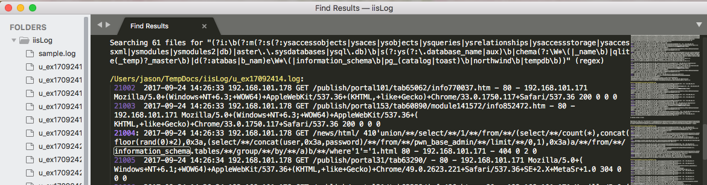

**香菇！！！！  ModSecurity-CRS + Ruby  搞不动了！  换方案！**

在使用ELK套件进行日志分析的工作中，攻击识别是很有必要的一项工作，而logstash的官方插件库中并没有这样功能的插件，故而考虑自己开发出来插件。
ModSecurity目前应该算是最好的开源WEB应用防火墙(WAF)，直接提取ModSecurity的规则库是一个不错的选择。

**so, just do it. **
<!--more-->
## 获取ModSecurity-CRS规则
    
OWASP ModSecurity Core Rule Set (CRS) Project (Official Repository) https://modsecurity.org/crs

下载规则库：
`git clone https://github.com/SpiderLabs/owasp-modsecurity-crs.git`

进入目录，先看看其中一个规则文件：./owasp-modsecurity-crs/rules/REQUEST-942-APPLICATION-ATTACK-**SQLI**.conf

其中检测数据库名称的配置信息如下：
```
#
# -=[ Detect DB Names ]=-
#
SecRule REQUEST_COOKIES|!REQUEST_COOKIES:/__utm/|REQUEST_COOKIES_NAMES|ARGS_NAMES|ARGS|XML:/* "(?i:\b(?:m(?:s(?:ysaccessobjects|ysaces|ysobjects|ysqueries|ysrelationships|ysaccessstorage|ysaccessxml|ysmodules|ysmodules2|db)|aster\.\.sysdatabases|ysql\.db)\b|s(?:ys(?:\.database_name|aux)\b|chema(?:\W*\(|_name\b)|qlite(_temp)?_master\b)|d(?:atabas|b_nam)e\W*\(|information_schema\b|pg_(catalog|toast)\b|northwind\b|tempdb\b))" \
	"phase:request,\
	rev:'3',\
	ver:'OWASP_CRS/3.0.0',\
	maturity:'9',\
	accuracy:'8',\
	capture,\
	t:none,t:urlDecodeUni,\
	ctl:auditLogParts=+E,\
	block,\
	msg:'SQL Injection Attack: Common DB Names Detected',\
	id:942140,\
	logdata:'Matched Data: %{TX.0} found within %{MATCHED_VAR_NAME}: %{MATCHED_VAR}',\
	severity:'CRITICAL',\
	tag:'application-multi',\
	tag:'language-multi',\
	tag:'platform-multi',\
	tag:'attack-sqli',\
	tag:'OWASP_CRS/WEB_ATTACK/SQL_INJECTION',\
	tag:'WASCTC/WASC-19',\
	tag:'OWASP_TOP_10/A1',\
	tag:'OWASP_AppSensor/CIE1',\
	tag:'PCI/6.5.2',\
	setvar:'tx.msg=%{rule.msg}',\
	setvar:tx.sql_injection_score=+%{tx.critical_anomaly_score},\
	setvar:tx.anomaly_score=+%{tx.critical_anomaly_score},\
	setvar:tx.%{rule.id}-OWASP_CRS/WEB_ATTACK/SQL_INJECTION-%{matched_var_name}=%{tx.0}"

```
正则表达式分析：
```
(?i:\b(
    ?:m(
        ?:s(
            ?:ysaccessobjects                   # 匹配msysaccessobjects
                |ysaces
                |ysobjects
                |ysqueries
                |ysrelationships
                |ysaccessstorage
                |ysaccessxml
                |ysmodules
                |ysmodules2
                |db
            )
        |aster\.\.sysdatabases|ysql\.db         # 匹配master
    )\b
    |s(
        ?:ys(?:\.database_name|aux)\b           # 配置sys.database_name或者sysaux
            |chema(?:\W*\(|_name\b)
            |qlite(_temp)?_master\b
    )
    |d(?:atabas|b_nam)e\W*\(
    |information_schema\b                       # 匹配information_schema
    |pg_(catalog|toast)\b
    |northwind\b
    |tempdb\b
    )
)
```
利用上述正则表达式，在日志文件中进行匹配：


## 插件编写

#### 1. 新建插件
利用[logstash-plugin命令](https://www.elastic.co/guide/en/logstash/current/plugin-generator.html)生成插件项目文件。

```bash
cd /Applications/logstash

bin/logstash-plugin generate --type filter --name attackDetection --path ~/Documents/Code/logstash-plugin
# 生成下列文件
 Creating /Users/jason/Documents/Code/logstash-plugin/logstash-filter-attackdetection
	 create logstash-filter-attackdetection/CHANGELOG.md
	 create logstash-filter-attackdetection/CONTRIBUTORS
	 create logstash-filter-attackdetection/DEVELOPER.md
	 create logstash-filter-attackdetection/Gemfile
	 create logstash-filter-attackdetection/lib/logstash/filters/attackDetection.rb
	 create logstash-filter-attackdetection/LICENSE
	 create logstash-filter-attackdetection/logstash-filter-attackDetection.gemspec
	 create logstash-filter-attackdetection/Rakefile
	 create logstash-filter-attackdetection/README.md
	 create logstash-filter-attackdetection/spec/filters/attackDetection_spec.rb
	 create logstash-filter-attackdetection/spec/spec_helper.rb
```

