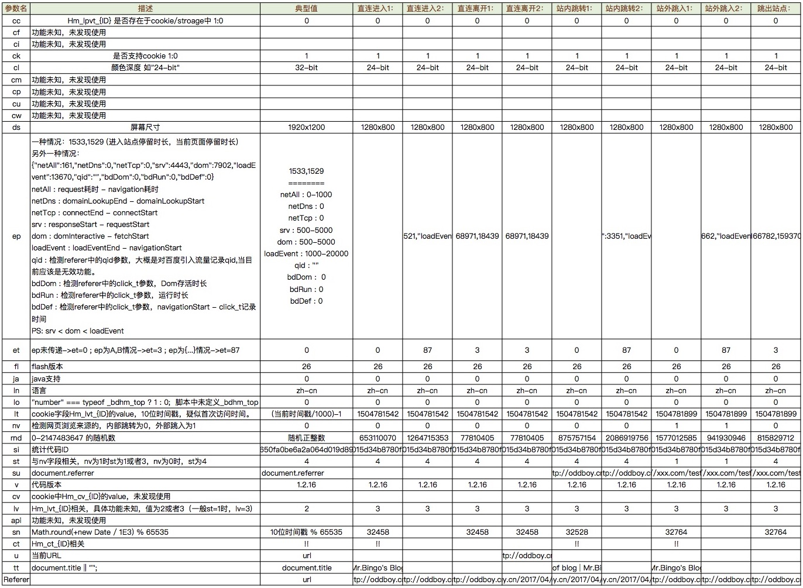

>   花了两天时间，终于把百度统计的js代码大概看了看，并写了个刷流量的Python脚本。 

<!-- more -->

### 实现原理

百度统计网站 [https://tongji.baidu.com](https://tongji.baidu.com)

```javascript
<script>
var _hmt = _hmt || [];
(function() {
	var hm = document.createElement("script");
	hm.src = "https://hm.baidu.com/hm.js?789fd650fa0xxxxxxxxxxxx9d890b87f";
	var s = document.getElementsByTagName("script")[0]; 
	s.parentNode.insertBefore(hm, s);
	})();
</script> 
```
1. 在需要统计的页面加入上面的代码，引入hm.js脚本。

2. 在获取该hm.js代码的同时，百度统计会往你的浏览器写入一个名字为“HMACCOUNT”的cookie，每一个cookie即为一个客户标识。（同IP不同用户的情况很常见，所以访问量不可能以IP为准）

3. hm.js脚本执行，获取一些浏览器/网页/访问来源等一系列信息，包括屏幕尺寸、颜色深度、flash版本、用户语言等。

### 参数分析

从js代码中可以得知，所有的参数包括“cc cf ci ck cl cm cp cu cw ds ep et fl ja ln lo lt nv rnd si st su v cv lv api sn ct u tt”。

经过吐血分析，大致的作用如下，以及一些实际示例（由于直接张贴有些乱，所以就贴图了。）


### python脚本实现

主要思路：

1. 访问目标url,获取标题和页面中的百度统计id。

2. 从西刺代理获取免费代理。

3. 访问hm.js获取cookie。

4. 提交两次略有差异的GET请求到hm.gif

```python
#! /usr/bin/env python3
# -*- coding: utf-8 -*-

import requests
from bs4 import BeautifulSoup
import argparse
import os
import sys
import re
import queue
import threading
import time
import logging
import random
from requests.packages.urllib3.exceptions import InsecureRequestWarning
requests.packages.urllib3.disable_warnings(InsecureRequestWarning)

logging.basicConfig(level=logging.WARNING)

class Proxyer(object):
    def __init__(self,proxyListFile=None):
        self.proxyListFile = proxyListFile
        self.proxyList = queue.Queue()      # proxy队列
        self.xici_url='http://www.xicidaili.com/nn/'
        self.xici_pageid=0                  # http://www.xicidaili.com/nn/{id}


    def readFromFile(self):
        with open(self.proxyListFile, 'r') as f:
            for line in f.readlines():
                self.proxyList.put(str.lower(line).strip("\n"))
        return

    def readFrom_xicidaili(self):   
        self.xici_pageid = self.xici_pageid + 1 if self.xici_pageid<500 else 1      # 只读取前500个页面中的代理。
        page_url = self.xici_url + str(self.xici_pageid) 
        print("Read Proxies From :: %s"%page_url)
        ipPool=[]
        headers={
        'Connection': 'close',
        'User-Agent': 'Mozilla/5.0 (Windows NT 10.0; Win64; x64) AppleWebKit/537.36 (KHTML, like Gecko) Chrome/56.0.2924.87 Safari/537.36',
        'Accept': 'text/html,application/xhtml+xml,application/xml;q=0.9,image/webp,*/*;q=0.8',
        'Accept-Language': 'zh-CN,zh;q=0.8,en;q=0.6',
        }
        # Make a GET request and read the response
        req = requests.get(page_url,headers=headers)

        html_str=req.text
        # the pattern(Regular expression) is depend on the response data from your url
        pattern = r'\s*<tr[\s\S]*?<td>(((2[0-4]\d|25[0-5]|[01]?\d\d?)\.){3}(2[0-4]\d|25[0-5]|[01]?\d\d?))</td>\s*?<td>(\d*?)</td>[\s\S]*?<a[\s\S]*?>(.*?)</a>[\s\S]*?<td>(HTTP|HTTPS)</td>'
        regex = re.compile(pattern)
        s = regex.findall(html_str)
        #s = [('221.204.103.145', '103.', '103', '145', '9797', '山西太原', 'HTTP'), ...]
        for host in s:
            hostdict = (host[0],host[4],host[5],host[-1])
            ipPool.append(hostdict)

        for x in ipPool:
            self.proxyList.put(str.lower('%s://%s:%s'% (x[3], x[0],x[1])))
        return

    def getAProxy(self):
        logging.info("tring get a proxy...")
        proxy = ""
        try:
            proxy = self.proxyList.get(timeout=1)
        except:
            if (self.proxyList.empty):
                if self.proxyListFile is None :
                    self.readFrom_xicidaili()
                else:
                    self.readFromFile()      # 读取一次用完后，再次读取。
            proxy = self.proxyList.get()
        return proxy

class Cheater(object):
    def __init__(self,proxy_obj,url,source,vistiThread,visitCount):
        self.proxyer=proxy_obj
        self.sourceUrl=source
        self.visitCount=visitCount
        self.vistiThread=vistiThread
        self.counter=0      # 已完成的访问数
        self.threadLock = threading.Lock()      # 用于计数器
        self.pageUrl=""
        self.pageTitle=""
        self.bdTongJiID=""

        try:
            r = requests.get(url)
            self.pageUrl = r.url
            print("当前页面URL :: ",self.pageUrl)
            
            soup = BeautifulSoup(r.text, 'lxml')
            html_str=soup.prettify()

            self.pageTitle=soup.title.string

            print("当前页面标题 :: ", self.pageTitle)
        except:
            print("目标网页读取失败！！！")
            sys.exit()
            
        try:

            self.bdTongJiID=re.search(r'hm.src = "https?\:\/\/hm.baidu.com\/hm.js\?(\w{32})";',html_str,re.I).group(1)   # 正则表达式提取32位字符串id
            print("获得百度统计代码ID :: ",self.bdTongJiID)
            if len(self.bdTongJiID)!=32 :
                print("百度统计ID异常")
                sys.exit()
        except:
            print("目标网页未引用百度统计js代码")
            sys.exit()

    def run_Threads(self):
        thread_arr=[]       # 线程列表list
        for i in range(self.vistiThread):
            t = threading.Thread(target=self.doCheat)
            thread_arr.append(t)
        for i in range(self.vistiThread):
            thread_arr[i].start()
        for i in range(self.vistiThread):
            thread_arr[i].join()

        print("Job Finish!!!  %d "%self.counter)   


    def doCheat(self):
        while self.counter<self.visitCount:  
            print(".",end="")
            proxy=self.proxyer.getAProxy()
            try:
                proxy=re.match(r'(https?\:\/\/(\d+\.){3}\d+\:\d+)',proxy).group(1)  # 正则表达式校验proxy
            except:
                print("proxy正则校验失败...")
                continue

            protocol=proxy.split("://")[0]
            headers={
                    'Connection': 'close',
                    'User-Agent': 'Mozilla/5.0 (Windows NT 10.0; Win64; x64) AppleWebKit/537.36 (KHTML, like Gecko) Chrome/56.0.2924.87 Safari/537.36',
                    'Accept': '*/*',
                    'Accept-Language': 'zh-CN,zh;q=0.8,en;q=0.6',
                    'Referer': self.pageUrl
            }

            try:
                s=""
                s=requests.session()
                # 访问hm.js?{ID}获取cookie
                s.get("https://hm.baidu.com/hm.js?"+self.bdTongJiID,headers=headers,proxies={protocol:proxy},verify=False,timeout=15)
                # 直接访问1 | 站外跳入1
                params={
                        'cc':'0',
                        'ck':'1',
                        'cl':'24-bit',
                        'ds':'1280x800',
                        'et':'0',
                        'fl':'26',
                        'ja':'0',
                        'ln':'zh-cn',
                        'lo':'0',
                        'lt':str(int(time.time())-2),     
                        'nv':str( 0 if (self.sourceUrl is None) else 1),
                        'rnd':str(random.randint(0,2147483647)),
                        'si':str(self.bdTongJiID),
                        'st':str( 4 if (self.sourceUrl is None) else 1),
                        #'su':str( self.sourceUrl if（self.sourceUrl is not None) else "" ),
                        'v':'1.2.16',
                        'lv':'3',
                        'sn':str(int(time.time())%65535),
                        'ct':'!!',
                        'tt':self.pageTitle
                }
                if self.sourceUrl is not None:
                    params['su']=self.sourceUrl
                # 第一次提交数据
                r=s.get("http://hm.baidu.com/hm.gif",headers=headers,params=params,proxies={protocol:proxy},verify=False,timeout=5)
                logging.info(r.url)
                time.sleep(1)
                # 直接访问2 | 站外跳入2
                params['et']='87'
                params['rnd']=str(random.randint(0,2147483647))
                params.pop('sn')    # 移除 sn
                params.pop('ct')    # 移除 ct
                params.pop('tt')    # 移除 tt
                ep={
                    'netAll':random.randint(5,500),
                    'netDns':0,
                    'netTcp':0,
                    'srv':random.randint(5,200),
                    'dom':random.randint(250,750),
                    'loadEvent':random.randint(800,1500),
                    'qid':"",
                    'bdDom':0,
                    'bdRun':0,
                    'bdDef':0
                }

                ep= '{"netAll":'+ str(random.randint(5,500)) + ',"netDns":0' + ',"netTcp":0' + ',"srv":' + str(random.randint(5,200)) +   ',"dom":' + str(random.randint(250,750))+',"loadEvent":' + str(random.randint(800,1500))+',"qid":"","bdDom":0,"bdRun":0,"bdDef":0}'

                params['ep']=str(ep)     # 顺序变乱，尚不清楚是否影响使用
                # 第二次提交数据
                r=s.get("http://hm.baidu.com/hm.gif",headers=headers,params=params,proxies={protocol:proxy},verify=False,timeout=5)
                logging.info(r.url)
                self.threadLock.acquire()
                self.counter = self.counter + 1
                print("\rSuccess %d times"%self.counter)
                self.threadLock.release()
            except:
                #print("Failed! Do again...")
                print(".",end="")
            finally:
                pass     

            time.sleep(1)

def main():
    headCharPic="\r        .--.\n       |o_o |    ------------------ \n       |:_/ |   < Author: Mr.Bingo >\n      //   \ \   ------------------ \n     (|     | ) <    oddboy.cn     >\n    /'\_   _/`\  ------------------\n    \___)=(___/\n"
    print(headCharPic)
    # Creating a parser
    parser=argparse.ArgumentParser(
        #prog="BingoBF",
        usage="%(prog)s [options] ",
        description='刷百度统计访问数据',
        epilog="+---+\n"
        )
    parser = argparse.ArgumentParser()

    parser.add_argument("-u",dest="url",action="store",required=True,help="目标URL，HM_ID从网页中提取")

    parser.add_argument("--proxyList",dest="proxyList",action="store",default=None,help="代理地址列表文件，格式： http://127.0.0.1:8080 ; 如空，则自动从xicidaili.com/nn上爬取。")

    parser.add_argument("-s",dest="source",action="store",default=None,help="流量来源地址")

    parser.add_argument("-c",dest="count",action="store",default=10, type=int , help="访问次数 (目前只实现单一网页,单次访问统计),默认10次")

    parser.add_argument("-t",dest="threads",action="store",default=1,type=int,help="线程数，默认为1")

    args=parser.parse_args()

    proxy_obj=Proxyer(args.proxyList)   # 生成一个Proxyer对象
    cheater_obj = Cheater(proxy_obj,args.url,args.source,args.threads,args.count)   # 生成一个Cheater对象

    cheater_obj.run_Threads()

if __name__ == '__main__':
    main()
```

