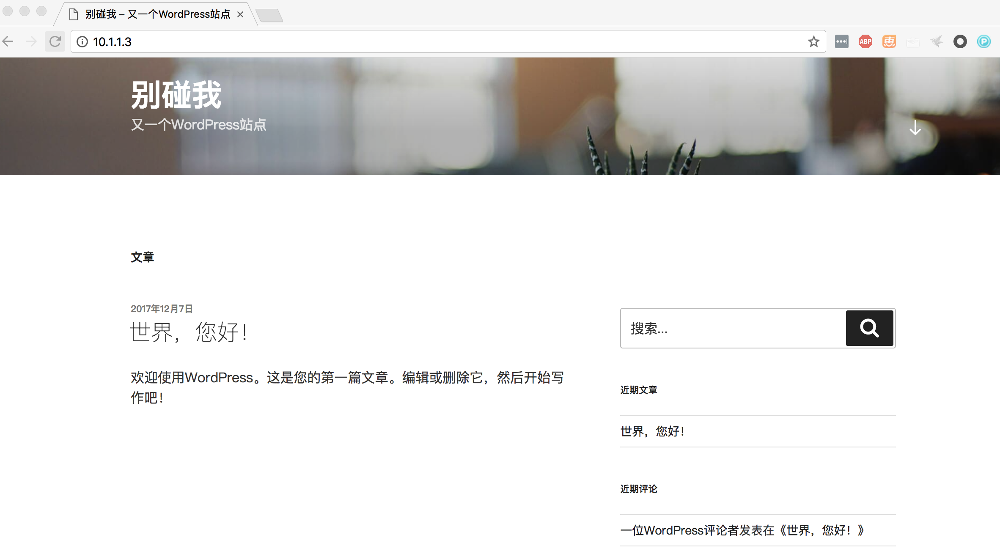
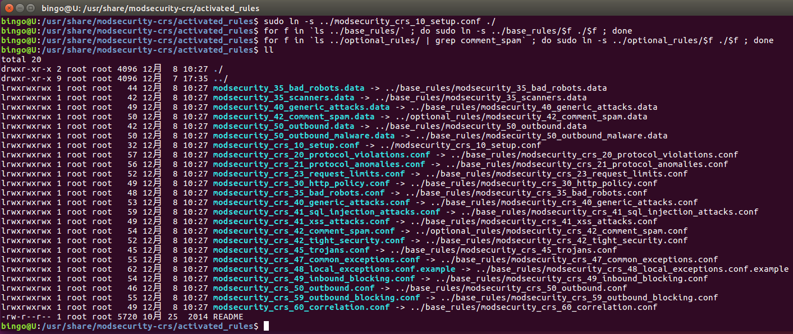
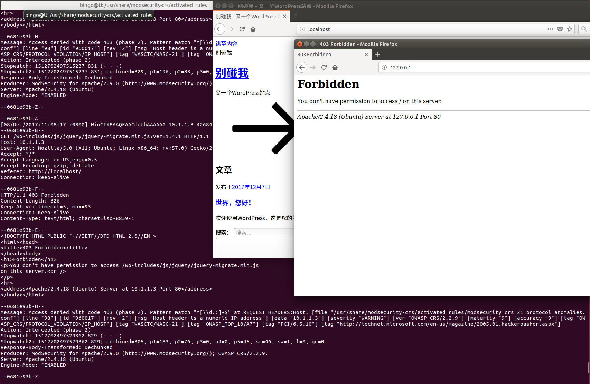
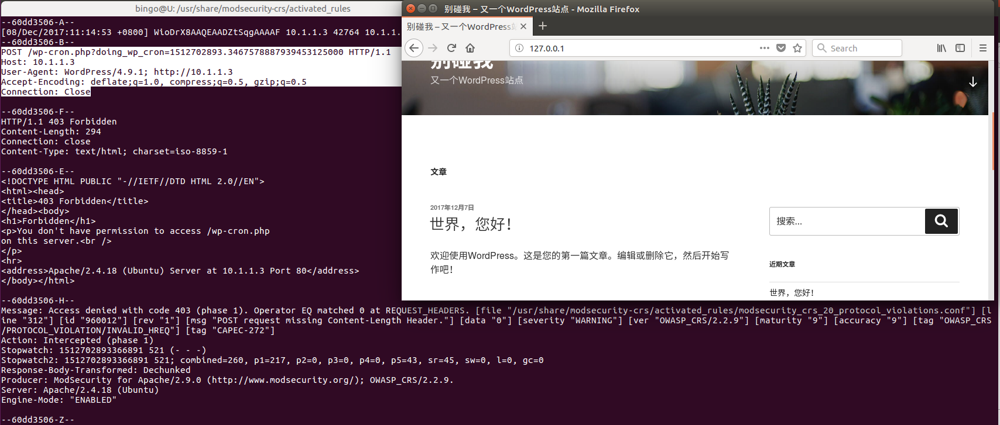
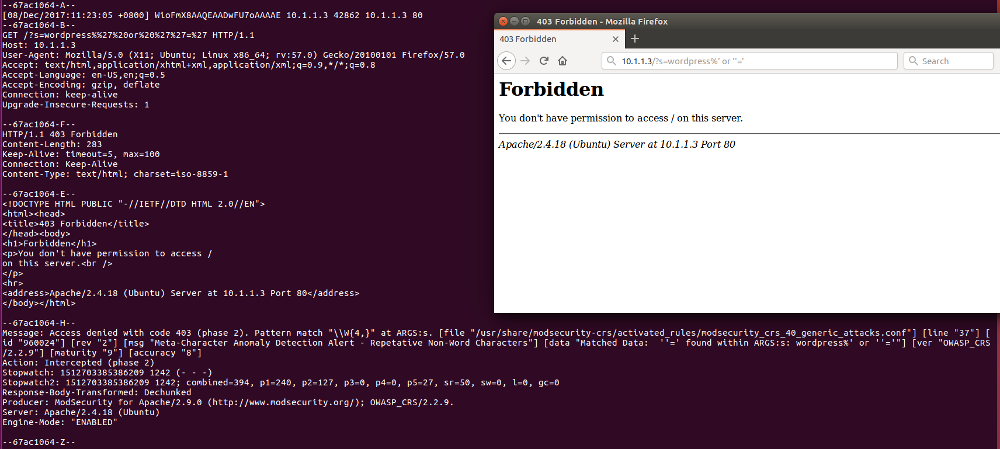
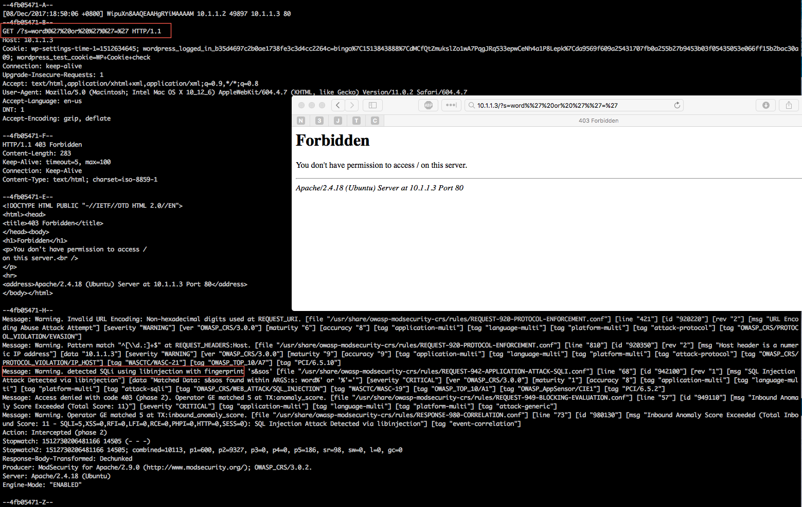
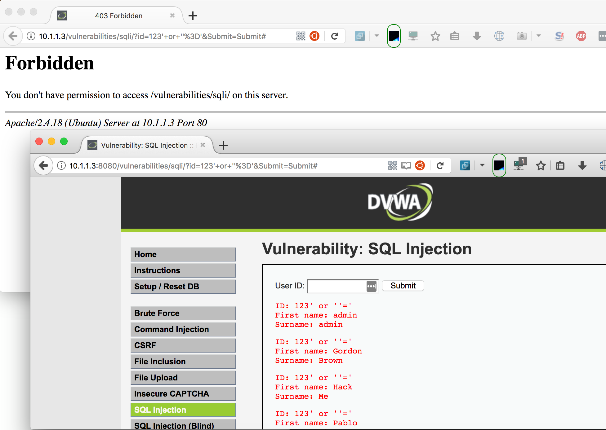
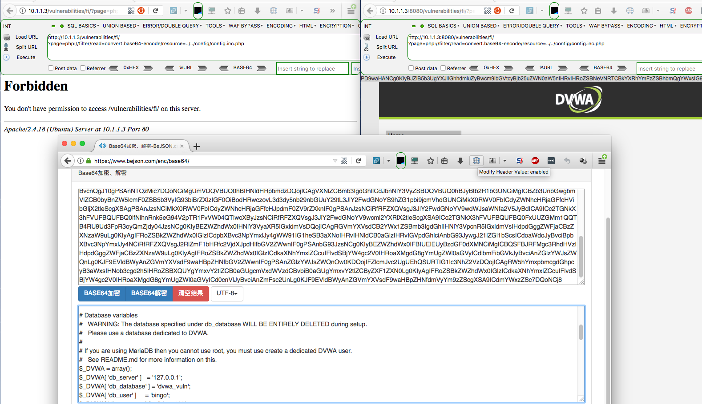
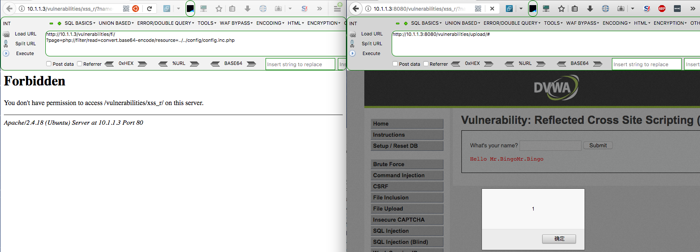

传统的防火墙技术中主要使用的两种技术分别是：**包过滤**和**状态检测**，这使其成为了最重要最基本的网络安全设备。如今，在各色各样的应用建立在HTTP等基础协议之上，而基于端口及IP的处理机制传统防火墙，无法有效识别和管理这些应用，更无法检查应用中附带的威胁代码。在刚性需求下，各种针对应用层的安全方案出炉,其中有一个种就叫做应用层防火墙(WAF)。

ModSecurity是一个开源的，跨平台的Web应用程序防火墙（WAF）模块，被称为WAF的“瑞士军刀”，它使网络应用程序维护者能够获得HTTP(S)流量的可见性，并提供强大的规则和API来实现高级保护。

在这篇文章中，我们在运行WordPress的Apache上配置ModSecurity，并进行效果检验。

<!-- more -->

## 安装测试网站
### 1.安装LAMP环境
```bash
$ apt-get install apache2
$ apt-get install php
$ apt-get install mysql-server

$ apache2 -v
$ mysqld -V
$ php -V

$ service apache2 status/start/stop/restart
$ service msyql status/start/stop/restart

$ sudo apt-get install libapache2-mod-php php-mysql
$ service apache2 restart
$ service mysql restart
```
- 坑0x01:**您的PHP似乎没有安装运行WordPress所必需的MySQL扩展。**
    ```
    因为之前Ubuntu中使用PPA安装了多版本PHP，具体是什么导致问题的不太清楚，但通过下面命令，将PHP版本切换到7.1后就正常了。
    Apache:-
    $ sudo a2dismod php5.6
    $ sudo a2enmod php7.1
    $ sudo service apache2 restart
    CLI:-
    $ update-alternatives --set php /usr/bin/php7.1
    ```
    [PHP多版本-传送门](http://localhost:4000/2017/07/PHP多版本安装与切换%28Ubuntu-16-04-LTS%29/)

- 坑0x02: MySQL数据库无法进入
不记得什么时候用过MySQL数据库的，应该没有设置过密码。
    ```bash
    $ mysql -uroot
    #ERROR 1698 (28000): Access denied for user 'root'@'localhost'
    # ↓↓↓↓↓↓↓↓↓↓
    $ mysqld --initialize
        mysqld: Cant create directory '/var/lib/mysql/' (Errcode: 13 - Permission denied)

    $ sudo chown mysql:mysql /var/lib/mysql
    $ sudo chown mysql:mysql /var/lib/mysql-files
    
    $ mysqld --initialize
    $ vim /var/log/mysql/error.log
    # 2017-12-07T07:16:49.383938Z 1 [Note] A temporary password is generated for root@localhost: gdk7uo+l-!S7

    $ systemctl start mysql  # 或者 service service mysql start
    $ mysql -uroot -p # 密码为：gdk7uo+l-!S7

    # 进入后修改root密码
    $ alter user 'root'@'localhost' identified by 'myNewPass';
    # 退出后重新登录
    ```
### 2. 安装WordPress
    ```
    $ mysql -uroot -p     
    $ create user bingo identified by 'myPass'; # 进行用户
    $ create database wordpress;
    $ grant all privileges on wordpress.* to bingo@localhost identified by "myPass";
    $ flush privileges;

    $ show databases; 
    ```
将WordPress安装包解压到/var/www/wordpress，并修改`/etc/apache2/sites-enabled/000-default.conf`文件中的DocumentRoot, 将/var/www/html修改为/var/www/wordpress 。
按照引导，顺利安装完成。


## 安装配置ModSecurity for Apache

### 1. 安装ModSecurity
Modsecurity在Debian/Ubuntu源中可用：
```
    $ apt-get install libapache2-modsecurity
```

验证是否加载了mod_security模块:
```
    $ apachectl -M | grep --color security
```
看到一个名为security2_module (shared)的模块，表示模块已加载。或者使用下面命令验证版本。
```
    $ apt-cache show libapache2-modsecurity
```
Modsecurity的安装包含必须重命名的推荐配置文件：
```bash
    $ sudo mv /etc/modsecurity/modsecurity.conf{-recommended,} 
```
重新加载Apache:
```
    $ service apache2 reload 
```
ModSecurity的新日志文件将在/var/log/apache2/modsec_audit.log的Apache日志目录中创建
```
    $ ll /var/log/apache2/modsec_audit.log
```
### 2. 配置ModSecurity
- #### 基本配置
    默认的ModSecurity配置文件设置为DetectionOnly ，根据规则匹配记录请求，不会阻塞任何东西。 这可以通过编辑modsecurity.conf文件和修改SecRuleEngine指令来改变。
    ```bash
    $ sudo sed -i“s / SecRuleEngine DetectionOnly / SecRuleEngine On /”/etc/modsecurity/modsecurity.conf
    ```
    SecResponseBodyAccess指令配置响应主体是否被缓冲（即通过ModSecurity读取）。 这只有在需要数据泄漏检测和保护时才是必要的。 因此，将其留在将消耗一定资源，也增加日志文件的大小，所以我们将关闭它。
    ```bash
    $ sudo sed -i“s / SecResponseBodyAccess On / SecResponseBodyAccess Off /”/etc/modsecurity/modsecurity.conf
    ```
- #### 可选配置
    还有其他的指令可以通过编辑/etc/modsecurity/modsecurity.conf来定制。 

    `SecRequestBodyLimit`和`SecRequestBodyNoFilesLimit`指令会限制可以POST到Web应用程序的最大数据量。

    `SecRequestBodyLimit`指令指定最大的POST数据大小。 如果客户端发送的数据量较大，则服务器将响应413 Request Entity Too Large错误。 如果Web应用程序没有任何文件上传，这个值可以大大减少。
    配置文件中指定的预配置值为13107200字节（12.5MB）
    ```
    SecRequestBodyLimit 13107200
    ```
    `SecRequestBodyNoFilesLimit`限制POST数据量除掉文件上传部分。这个值应尽可能低，以减少有人发送大尺寸的请求主体时拒绝服务（DoS）攻击的可能性。 配置文件中的预配置值为131072字节（128KB）。
    ```
    SecRequestBodyInMemoryLimit 131072 
    ```
    SecRequestBodyInMemoryLimit` 这个指令关乎服务器性能，它指定多少“请求主体”数据（POST数据）保存在内存（RAM）中，而其余的部分放在硬盘中（就像swapping）。如果使用的是固态硬盘，影响不大。如果有足够的RAM可用，可以配置一个更合适的值。该指令的预配置值是128KB。
    ```
    SecRequestBodyInMemoryLimit 131072 
    ```

### 3. 规则设置
在这一步中，我们将设置一些ModSecurity规则。
- #### 启动CRS
    为了方便起见，ModSecurity已经安装了很多规则。 这些被称为CRS（Core Rule Set），位于/usr/share/modsecurity-crs目录中。 要加载这些规则，我们需要配置Apache来读取这些目录中的.conf文件，所以打开security2.conf文件进行编辑。
    ```
    $ sudo vim /etc/apache2/mods-enabled/security2.conf 
    ```
    在`<IfModule security2_module> </IfModule>`添加以下指令:
    ```bash
        IncludeOptional /etc/modsecurity/*.conf 
        #IncludeOptional /usr/share/modsecurity-crs/*.conf
        IncludeOptional /usr/share/modsecurity-crs/activated_rules/*.conf
    ```
- #### 目录/域排除(可选)
    有时，如果运行某个应用程序（如phpMyAdmin），则排除特定目录或域名是有意义的，因为ModSecurity将阻止SQL查询。排除CMS(如：WordPress）管理后台也是不错的选择。

    要在VirtualHost中禁用ModSecurity，请将以下指令放置在其虚拟主机文件的`<VirtualHost>[...]</VirtualHost>`块中。
    ```xml
    <IfModule security2_module> SecRuleEngine Off </IfModule>
    ```
    排除特定目录（如：/var/www/wordpress/wp-admin):
    ```xml
     <Directory "/var/www/wp-admin">
        <IfModule security2_module> 
            SecRuleEngine Off 
        </IfModule>
    </Directory> 
    ```
    如果您不想在目录中完全禁用ModSecurity，请使用SecRuleRemoveById指令通过指定其ID来排除特定的规则或规则链。
    ```xml
     <LocationMatch "/wp-admin/update.php">
        <IfModule security2_module>
            SecRuleRemoveById 981173
        </IfModule>
    </LocationMatch> 
    ```
### 4. 规则激活
接下来，我们将激活规则文件。所需的规则文件应该被link到activated_rules目录，这与Apache mods-enabled目录类似。 切换到activated_rules目录。
```
    $ cd /usr/share/modsecurity-crs/activated_rules/
```
该目录中的README文件描述了symlinks的创建方法。

```bash
$ sudo ln -s ../modsecurity_crs_10_setup.conf ./

$ for f in `ls ../base_rules/` ; do sudo ln -s ../base_rules/$f ./$f ; done

$ for f in `ls ../optional_rules/ | grep comment_spam` ; do sudo ln -s ../optional_rules/$f ./$f ; done

$ ls -l ./
```


重启Apache2以使规则生效
```
    $ systemctl restart apache2
```
运行效果：

从运行日志可以看出，无法正常访问的原因是，命中了modsecurity_crs_21_protocol_anomalies.conf中的规则。

从activated_rules目录中移除modsecurity_crs_21_protocol_anomalies.conf后

仍有一个访问被拦截，原因是"POST request missing Content-Length Header."

移除modsecurity_crs_20_protocol_violations.conf规则后，访问页面无日志产生。

尝试访问  [http://10.1.1.3/?s=wordpress%' or ''='](#)


被成功拦截。

### 5. 升级CRS到最新版本
上一个节中使用的ModSecurity自带CRS，其版本为2.2.9，而目前最新的CRS已经为3.0.2版本，所以手动更新CRS还是有必要的。
官方主页 ： https://modsecurity.org/crs/
```
$ cd /usr/share/
$ git clone https://github.com/SpiderLabs/owasp-modsecurity-crs.git
$ cd owasp-modsecurity-crs
$ vim INSTALL
```
参考 [INSTALL](https://raw.githubusercontent.com/SpiderLabs/owasp-modsecurity-crs/v3.0/master/INSTALL) 文件进行安装

- 将`crs-setup.conf.example`复制到`crs-setup.conf`

- 重命名`rules/REQUEST-900-EXCLUSION-RULES-BEFORE-CRS.conf.example`和`rules/RESPONSE-999-EXCLUSION-RULES-AFTER-CRS.conf.example`，删除'.example'扩展名。 如此，在升级的时候不会被覆盖。


- 修改 `mods-enabled/security2.conf` 文件中 `<IfModule security2_module> </IfModule>` 配置

- 重启Apache

    ```bash
    $ sudo cp crs-setup.conf.example crs-setup.conf

    $ sudo cp rules/REQUEST-900-EXCLUSION-RULES-BEFORE-CRS.conf.example rules/REQUEST-900-EXCLUSION-RULES-BEFORE-CRS.conf
    $ sudo cp rules/RESPONSE-999-EXCLUSION-RULES-AFTER-CRS.conf.example rules/RESPONSE-999-EXCLUSION-RULES-AFTER-CRS.conf

    $ sudo vim /etc/apache2/mods-enabled/security2.conf
    # >>>>>>
        # IncludeOPtional 与 Include 作用一致
        IncludeOptional /etc/modsecurity/*.conf
        Include /usr/share/owasp-modsecurity-crs/crs-setup.conf
        IncludeOptional /usr/share/owasp-modsecurity-crs/rules/*.conf
    # <<<<<<
    $ sudo systemctl restart apache2
    ```
提交攻击性访问


成功拦截！

## 给DVWA武装上ModSecurity
DVWA是一款基于php&mysql编写的用于常规WEB漏洞检测的脆弱web应用,其中包含了一些常见的WEB漏洞。今天，我们试试让DVWA武装上ModSecurity，看看在网络攻击中能够坚挺？

### 1. 部署DVWA
```bash
# 下载并解压DVWA
$ wget https://github.com/ethicalhack3r/DVWA/archive/master.zip
$ unzip master.zip -d /var/www/    # DVWA-master
$ cp /var/www/DVWA-master /var/www/DVWA-ignoreModSec    

# 修改Apache配置
$ cd /etc/apache2/sites-available
$ sudo vim /etc/apache2/sites-enabled/000-default.conf
    # >>>   修改DocumentRoot
    DocumentRoot /var/www/DVWA-master
    # <<<
$ sudo vim /etc/apache2/port.conf
    # >>>   添加8080端口
    Listen 80
    Listen 8080
    # <<<<

$ cp /etc/apache2/sites-enabled/000-default.conf /etc/apache2/sites-enabled/001-dvwa8080.conf
$ sudo ln -sf /etc/apache2/sites-available/001-dvwa8080.conf /etc/apache2/sites-enabled/001-dvwa8080.conf
$ cd /etc/apache2/sites-enabled/
$ vim 001-dvwa8080.conf
    # >>>   修改 *:80 为 *:8080   在此域名中关闭ModSecurity
    <VirtualHost *:8080>
        DocumentRoot /var/www/DVWA-ignoreModSec
        <IfModule security2_module>
                SecRuleEngine Off
        </IfModule>
    # <<<

$ service apache2 restart

# MySQL配置
$ mysql -uroot -p
    mysql> create database dvwa;    # dvwa数据库，用于被ModSecurity保护的DVWA实例
    mysql> create user bingo identified by 'myPass'; 
    mysql> grant all privileges on dvwa.* to bingo@localhost identified by "myPass";    
    mysql> flush privileges;

    mysql> create database dvwa-vuln;   # dvwa_vuln数据库，用于暴露的DVWA实例
    mysql> grant all privileges on dvwa_vuln.* to bingo@localhost identified by "myPass";
    mysql> flush privileges;

# 配置DVWA
$ cd /var/www/DVWA-master
$ cp config/config.inc.php.dist config/config.inc.php
$ vim config/config.inc.php
    # >>>   修改数据库配置及DVWA安全级别
    $_DVWA[ 'db_server' ]   = '127.0.0.1';
    $_DVWA[ 'db_database' ] = 'dvwa';
    $_DVWA[ 'db_user' ]     = 'bingo';
    $_DVWA[ 'db_password' ] = 'myPass';
    $_DVWA[ 'default_security_level' ] = 'low';
    # <<<

$ cd /var/www/DVWA-ignoreModSec
$ cp config/config.inc.php.dist config/config.inc.php
$ vim config/config.inc.php
    # >>>   修改数据库配置及DVWA安全级别
    $_DVWA[ 'db_server' ]   = '127.0.0.1';
    $_DVWA[ 'db_database' ] = 'dvwa_vuln';
    $_DVWA[ 'db_user' ]     = 'bingo';
    $_DVWA[ 'db_password' ] = 'myPass';
    $_DVWA[ 'default_security_level' ] = 'low';
    # <<<
```
### 2. 对比测试
两套DVWA同时运行，80和8080端口，80端口被ModSecurity保护，而ModSecurity则没有。
- SQL注入：


- 文件包含：


- XSS：


由此可见，ModSecurity起到了一定的防护作用。

不过，在代码执行与文件上传未能成功防御。

## 后记
下一步，我将探索ModSecurity为代表的WAF防御规则，分析传统防御规则的缺陷，及改进思路。

下两步，我将探索基于语义分析、机器学习的应用技术。。。

## 参考资料

https://github.com/SpiderLabs/ModSecurity/wiki/Reference-Manual

https://www.netnea.com/cms/apache-tutorial-7_including-modsecurity-core-rules/

https://www.digitalocean.com/community/tutorials/how-to-set-up-mod_security-with-apache-on-debian-ubuntu

https://www.digitalocean.com/community/tutorials/how-to-set-up-modsecurity-with-apache-on-ubuntu-14-04-and-debian-8

https://www.linode.com/docs/web-servers/apache-tips-and-tricks/configure-modsecurity-on-apache/

https://komunity.komand.com/learn/article/server-administration/how-to-configure-modsecurity-with-apache-on-ubuntu-linux/

https://www.feistyduck.com/library/modsecurity-handbook-2ed-free/?t=ce4c8:fa719091acb66f8f

https://www.cnblogs.com/shengulong/p/6210234.html

